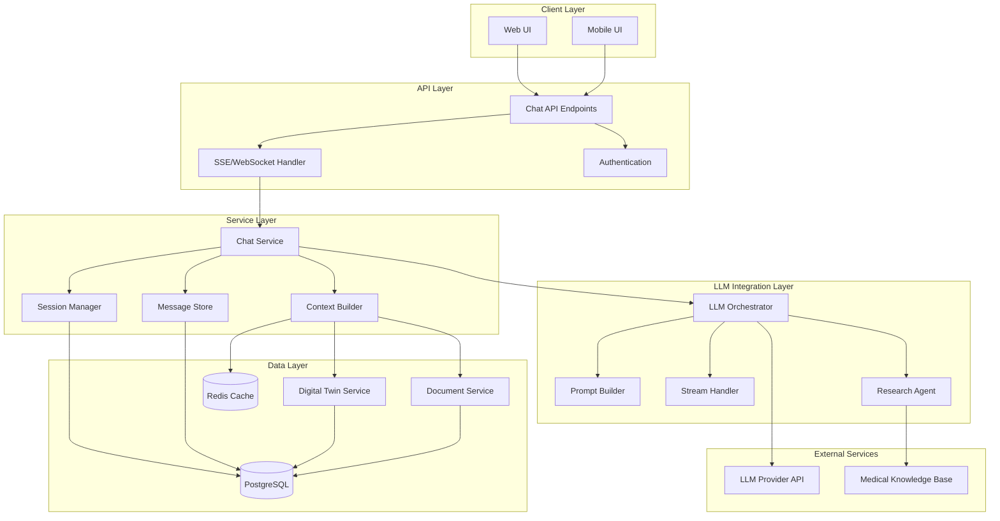

# Design Document: Health Chat Assistant

## Overview

The Health Chat Assistant is an LLM-powered conversational interface that provides personalized health guidance by integrating the user's digital twin data as context. The system enables natural, ChatGPT-like conversations while maintaining medical safety boundaries and providing evidence-based information.

The architecture follows a streaming-first approach where responses are generated token-by-token and delivered in real-time via Server-Sent Events. The system maintains conversation history, performs contextual research when needed, and seamlessly integrates biomarker data, medical history, and lifestyle information to provide personalized responses.

## Architecture

### High-Level Architecture



### Component Flow

1. **User sends message** → Chat API receives request
2. **Authentication** → Verify user identity and session access
3. **Session Management** → Load or create chat session
4. **Context Building** → Gather relevant digital twin data and conversation history
5. **Prompt Construction** → Build LLM prompt with context and safety guidelines
6. **LLM Invocation** → Call LLM provider API with streaming enabled
7. **Stream Handling** → Forward tokens to client via SSE
8. **Message Persistence** → Save user message and assistant response
9. **Response Delivery** → Complete streaming and close connection

## Components and Interfaces

### 1. Chat Service

The main orchestrator for chat interactions.

```python
class ChatService:
    """
    Orchestrates chat interactions between users and the LLM.
    """
    
    async def send_message(
        self,
        user_id: str,
        session_id: str,
        message: str
    ) -> AsyncIterator[str]:
        """
        Send a user message and stream the assistant's response.
        
        Args:
            user_id: User identifier
            session_id: Chat session identifier
            message: User's message text
            
        Yields:
            Response tokens as they are generated
        """
        pass
    
    async def create_session(
        self,
        user_id: str,
        title: Optional[str] = None
    ) -> ChatSession:
        """
        Create a new chat session for a user.
        """
        pass
    
    async def get_session(
        self,
        user_id: str,
        session_id: str
    ) -> ChatSession:
        """
        Retrieve a chat session with message history.
        """
        pass
    
    async def list_sessions(
        self,
        user_id: str,
        limit: int = 50
    ) -> List[ChatSessionSummary]:
        """
        List all chat sessions for a user.
        """
        pass
    
    async def delete_session(
        self,
        user_id: str,
        session_id: str
    ) -> bool:
        """
        Delete a chat session and all associated messages.
        """
        pass
```

### 2. Session Manager

Manages chat session lifecycle and metadata.

```python
class SessionManager:
    """
    Manages chat session creation, retrieval, and lifecycle.
    """
    
    async def create_session(
        self,
        user_id: str,
        title: Optional[str] = None
    ) -> ChatSession:
        """
        Create a new chat session.
        """
        pass
    
    async def get_session(
        self,
        session_id: str
    ) -> Optional[ChatSession]:
        """
        Retrieve session by ID.
        """
        pass
    
    async def update_session_activity(
        self,
        session_id: str
    ) -> None:
        """
        Update last_activity timestamp for a session.
        """
        pass
    
    async def archive_inactive_sessions(
        self,
        days_inactive: int = 30
    ) -> int:
        """
        Archive sessions inactive for specified days.
        Returns count of archived sessions.
        """
        pass
```

### 3. Context Builder

Constructs the context window for LLM prompts.

```python
class ContextBuilder:
    """
    Builds context from digital twin data and conversation history.
    """
    
    async def build_context(
        self,
        user_id: str,
        session_id: str,
        max_tokens: int = 4000
    ) -> ChatContext:
        """
        Build complete context for LLM prompt.
        
        Args:
            user_id: User identifier
            session_id: Chat session identifier
            max_tokens: Maximum tokens for context window
            
        Returns:
            ChatContext with digital twin data and message history
        """
        pass
    
    async def get_relevant_biomarkers(
        self,
        user_id: str,
        query: str
    ) -> List[BiomarkerData]:
        """
        Retrieve biomarkers relevant to the user's query.
        """
        pass
    
    async def get_relevant_documents(
        self,
        user_id: str,
        query: str,
        limit: int = 3
    ) -> List[DocumentSummary]:
        """
        Retrieve documents relevant to the query.
        """
        pass
    
    def summarize_conversation_history(
        self,
        messages: List[Message],
        max_tokens: int
    ) -> str:
        """
        Summarize older messages to fit context window.
        """
        pass
```

### 4. LLM Orchestrator

Manages LLM API calls and streaming.

```python
class LLMOrchestrator:
    """
    Orchestrates LLM API calls with streaming support.
    """
    
    async def generate_response(
        self,
        context: ChatContext,
        user_message: str,
        stream: bool = True
    ) -> AsyncIterator[str]:
        """
        Generate streaming response from LLM.
        
        Args:
            context: Chat context with digital twin and history
            user_message: Current user message
            stream: Enable streaming (default True)
            
        Yields:
            Response tokens as they are generated
        """
        pass
    
    async def generate_with_research(
        self,
        context: ChatContext,
        user_message: str,
        research_query: str
    ) -> AsyncIterator[str]:
        """
        Generate response with additional research.
        """
        pass
    
    def should_perform_research(
        self,
        user_message: str,
        context: ChatContext
    ) -> Optional[str]:
        """
        Determine if research is needed and return research query.
        Returns None if no research needed.
        """
        pass
```

### 5. Prompt Builder

Constructs prompts for the LLM with safety guidelines.

```python
class PromptBuilder:
    """
    Builds prompts for LLM with context and safety guidelines.
    """
    
    def build_system_prompt(
        self,
        context: ChatContext
    ) -> str:
        """
        Build system prompt with digital twin context and guidelines.
        """
        pass
    
    def build_user_prompt(
        self,
        message: str,
        research_results: Optional[str] = None
    ) -> str:
        """
        Build user prompt with optional research results.
        """
        pass
    
    def get_safety_guidelines(self) -> str:
        """
        Return medical safety guidelines for the LLM.
        """
        pass
    
    def format_digital_twin_context(
        self,
        digital_twin: DigitalTwin
    ) -> str:
        """
        Format digital twin data for LLM context.
        """
        pass
```

### 6. Message Store

Persists and retrieves chat messages.

```python
class MessageStore:
    """
    Handles persistence of chat messages.
    """
    
    async def save_message(
        self,
        session_id: str,
        message: Message
    ) -> Message:
        """
        Save a message to storage.
        """
        pass
    
    async def get_messages(
        self,
        session_id: str,
        limit: Optional[int] = None,
        before_id: Optional[str] = None
    ) -> List[Message]:
        """
        Retrieve messages for a session.
        """
        pass
    
    async def delete_session_messages(
        self,
        session_id: str
    ) -> int:
        """
        Delete all messages for a session.
        Returns count of deleted messages.
        """
        pass
    
    async def update_message(
        self,
        message_id: str,
        content: str
    ) -> Message:
        """
        Update message content (for partial responses).
        """
        pass
```

### 7. Research Agent

Performs medical knowledge retrieval when needed.

```python
class ResearchAgent:
    """
    Retrieves medical knowledge for complex queries.
    """
    
    async def research(
        self,
        query: str,
        max_results: int = 5
    ) -> ResearchResults:
        """
        Perform research on a medical topic.
        
        Args:
            query: Research query
            max_results: Maximum number of sources to retrieve
            
        Returns:
            ResearchResults with sources and synthesized information
        """
        pass
    
    async def search_medical_knowledge(
        self,
        query: str
    ) -> List[MedicalSource]:
        """
        Search medical knowledge base.
        """
        pass
    
    def synthesize_sources(
        self,
        sources: List[MedicalSource]
    ) -> str:
        """
        Synthesize information from multiple sources.
        """
        pass
```

### 8. Stream Handler

Manages SSE streaming to clients.

```python
class StreamHandler:
    """
    Handles Server-Sent Events streaming.
    """
    
    async def stream_response(
        self,
        response_generator: AsyncIterator[str],
        session_id: str
    ) -> AsyncIterator[str]:
        """
        Stream LLM response to client via SSE.
        
        Args:
            response_generator: Async generator of response tokens
            session_id: Chat session identifier
            
        Yields:
            SSE-formatted messages
        """
        pass
    
    def format_sse_message(
        self,
        data: str,
        event_type: str = "message"
    ) -> str:
        """
        Format data as SSE message.
        """
        pass
    
    async def handle_stream_error(
        self,
        error: Exception,
        partial_response: str
    ) -> str:
        """
        Handle streaming errors gracefully.
        """
        pass
```

## Data Models

### ChatSession

```python
class ChatSession(BaseModel):
    """Chat session metadata."""
    
    session_id: str  # UUID
    user_id: str
    title: Optional[str]
    created_at: datetime
    last_activity: datetime
    is_archived: bool = False
    message_count: int = 0
```

### ChatSessionSummary

```python
class ChatSessionSummary(BaseModel):
    """Summary of a chat session for listing."""
    
    session_id: str
    title: Optional[str]
    last_message_preview: str
    last_activity: datetime
    message_count: int
    is_archived: bool
```

### Message

```python
class MessageRole(str, Enum):
    USER = "user"
    ASSISTANT = "assistant"
    SYSTEM = "system"


class Message(BaseModel):
    """A single message in a chat session."""
    
    message_id: str  # UUID
    session_id: str
    role: MessageRole
    content: str
    created_at: datetime
    
    # Metadata
    token_count: Optional[int]
    model_version: Optional[str]
    research_performed: bool = False
    
    # References
    referenced_documents: List[str] = []
    referenced_biomarkers: List[str] = []
```

### ChatContext

```python
class ChatContext(BaseModel):
    """Context provided to LLM for response generation."""
    
    user_id: str
    session_id: str
    
    # Digital twin data
    digital_twin_summary: str
    relevant_biomarkers: List[BiomarkerData]
    active_conditions: List[str]
    current_medications: List[str]
    
    # Conversation history
    recent_messages: List[Message]
    conversation_summary: Optional[str]
    
    # Documents
    relevant_documents: List[DocumentSummary]
    
    # Metadata
    total_tokens: int
```

### ResearchResults

```python
class ResearchResults(BaseModel):
    """Results from medical knowledge research."""
    
    query: str
    sources: List[MedicalSource]
    synthesized_info: str
    performed_at: datetime
```

### MedicalSource

```python
class MedicalSource(BaseModel):
    """A medical knowledge source."""
    
    title: str
    url: Optional[str]
    excerpt: str
    credibility_score: float  # 0-1
    publication_date: Optional[date]
```

### StreamEvent

```python
class StreamEventType(str, Enum):
    TOKEN = "token"
    RESEARCH_START = "research_start"
    RESEARCH_COMPLETE = "research_complete"
    COMPLETE = "complete"
    ERROR = "error"


class StreamEvent(BaseModel):
    """Event in the response stream."""
    
    event_type: StreamEventType
    data: str
    timestamp: datetime
```

## Correctness Properties

*A property is a characteristic or behavior that should hold true across all valid executions of a system—essentially, a formal statement about what the system should do. Properties serve as the bridge between human-readable specifications and machine-verifiable correctness guarantees.*

### Property 1: Response Generation for All Messages
*For any* user message sent to a session, the system SHALL generate and return a response.

**Validates: Requirements 1.1**

### Property 2: Conversation History Maintenance
*For any* chat session with multiple messages, subsequent responses SHALL have access to all previous messages in that session's history.

**Validates: Requirements 1.2, 7.1**

### Property 3: Context Summarization on Overflow
*For any* conversation that exceeds the maximum context token limit, the system SHALL summarize older messages to fit within the limit.

**Validates: Requirements 1.4**

### Property 4: Digital Twin Context Inclusion
*For any* response generation, the ChatContext SHALL include digital twin data (biomarkers, conditions, medications) when available for the user.

**Validates: Requirements 2.1**

### Property 5: Biomarker Value Citation
*For any* response that references a user's biomarker, the response SHALL include the actual value and test date from the digital twin.

**Validates: Requirements 2.2, 2.5**

### Property 6: Medical Condition Awareness
*For any* user with active medical conditions, responses SHALL reference these conditions when providing health recommendations.

**Validates: Requirements 2.3**

### Property 7: Missing Data Acknowledgment
*For any* user with incomplete digital twin data, when relevant data is missing for a query, the response SHALL acknowledge the limitation and suggest data collection.

**Validates: Requirements 2.4**

### Property 8: Streaming Token Delivery
*For any* response generation, tokens SHALL be delivered incrementally rather than all at once (streaming mode).

**Validates: Requirements 3.1**

### Property 9: Stream Completion Signal
*For any* completed response stream, a completion event SHALL be sent to signal the end of the response.

**Validates: Requirements 3.4**

### Property 10: Graceful Stream Error Handling
*For any* streaming error that occurs during response generation, the system SHALL handle the error gracefully and complete the message with available content.

**Validates: Requirements 3.3**

### Property 11: Cancellation Handling
*For any* user cancellation during streaming, the system SHALL stop generation and persist the partial response.

**Validates: Requirements 3.5**

### Property 12: Message Persistence
*For any* message sent or received in a session, the message SHALL be persisted to storage.

**Validates: Requirements 4.1**

### Property 13: Complete History Retrieval
*For any* session retrieval, all messages associated with that session SHALL be loaded and returned.

**Validates: Requirements 4.2, 6.3**

### Property 14: Chronological Message Ordering
*For any* message history retrieval, messages SHALL be ordered by their created_at timestamp in ascending order.

**Validates: Requirements 4.3**

### Property 15: Cascade Deletion
*For any* session deletion, all messages associated with that session SHALL also be deleted.

**Validates: Requirements 4.4, 6.4**

### Property 16: Session Summary Completeness
*For any* session listing, each session summary SHALL include the most recent message preview and last_activity timestamp.

**Validates: Requirements 4.5**

### Property 17: Research Triggering
*For any* query that requires medical knowledge beyond the digital twin context, the system SHALL perform research and retrieve relevant medical information.

**Validates: Requirements 5.1**

### Property 18: Source Citation
*For any* response that includes medical information from research, the response SHALL include citations to the sources.

**Validates: Requirements 5.2**

### Property 19: Research Indication
*For any* research operation, a research_start event SHALL be sent before research begins.

**Validates: Requirements 5.3**

### Property 20: Research Failure Handling
*For any* research operation that fails, the system SHALL acknowledge the limitation and provide general guidance without research results.

**Validates: Requirements 5.5**

### Property 21: Unique Session Identifiers
*For any* newly created session, the session SHALL have a unique session_id that differs from all existing sessions.

**Validates: Requirements 6.1**

### Property 22: Session Ordering by Activity
*For any* session listing, sessions SHALL be ordered by last_activity timestamp in descending order (most recent first).

**Validates: Requirements 6.2**

### Property 23: Automatic Archiving
*For any* session with last_activity older than 30 days, the session SHALL be marked as archived (is_archived = true) while retaining all data.

**Validates: Requirements 6.5**

### Property 24: Medical Disclaimer Inclusion
*For any* response providing health advice, the response SHALL include a disclaimer about not replacing medical professionals.

**Validates: Requirements 8.1**

### Property 25: Emergency Symptom Response
*For any* query mentioning emergency symptoms (chest pain, difficulty breathing, severe bleeding), the response SHALL recommend immediate medical attention.

**Validates: Requirements 8.2**

### Property 26: Diagnosis Refusal
*For any* query asking for a medical diagnosis, the response SHALL decline to diagnose and suggest consulting a healthcare provider.

**Validates: Requirements 8.3**

### Property 27: Medication Change Warning
*For any* query about changing medications, the response SHALL advise consulting with a doctor before making changes.

**Validates: Requirements 8.4**

### Property 28: Model Version Tracking
*For any* generated response, the message metadata SHALL include the LLM model version used for generation.

**Validates: Requirements 9.1**

### Property 29: Units and Reference Ranges
*For any* response that includes numerical biomarker data, the response SHALL include units and reference ranges for those biomarkers.

**Validates: Requirements 9.4**

### Property 30: First Token Response Time
*For any* response generation under normal load, the time to first token SHALL be under 3 seconds.

**Validates: Requirements 10.1**

### Property 31: Queue Position Feedback
*For any* request that is queued due to high load, the system SHALL provide queue position feedback to the user.

**Validates: Requirements 10.2**

### Property 32: Graceful Degradation Under Load
*For any* system experiencing high load, the context window size SHALL be reduced to maintain performance.

**Validates: Requirements 10.3**

### Property 33: Digital Twin Data Caching
*For any* frequently accessed digital twin data, the data SHALL be cached to improve response times.

**Validates: Requirements 10.4**

### Property 34: Rate Limit Communication
*For any* request that exceeds rate limits, the system SHALL inform the user and suggest retry timing.

**Validates: Requirements 10.5**

### Property 35: Document Context Inclusion
*For any* query that references a specific document, the relevant document data SHALL be retrieved and included in the context.

**Validates: Requirements 11.1**

### Property 36: Document Biomarker Extraction
*For any* document containing biomarker data that is referenced in a query, the specific biomarker values SHALL be extracted and included in the response.

**Validates: Requirements 11.2**

### Property 37: Document Relevance Selection
*For any* query where multiple documents exist, the most relevant document SHALL be identified and prioritized in the context.

**Validates: Requirements 11.3**

### Property 38: Document Summarization
*For any* document mentioned in a query, a summary of key findings from that document SHALL be provided in the response.

**Validates: Requirements 11.4**

### Property 39: Missing Document Handling
*For any* query referencing a non-existent or unavailable document, the system SHALL inform the user and continue with available data.

**Validates: Requirements 11.5**

### Property 40: LLM Request Retry Logic
*For any* failed LLM API request, the system SHALL retry with exponential backoff before failing.

**Validates: Requirements 12.1**

### Property 41: Retry Exhaustion Error Message
*For any* LLM request where all retries are exhausted, the system SHALL provide a user-friendly error message.

**Validates: Requirements 12.2**

### Property 42: Digital Twin Fallback
*For any* situation where digital twin data is temporarily unavailable, the system SHALL continue with cached data or provide general responses.

**Validates: Requirements 12.3**

### Property 43: Message Save Failure Handling
*For any* message that fails to save, the system SHALL alert the user and attempt to resend.

**Validates: Requirements 12.4**

### Property 44: Seamless Error Recovery
*For any* error that is recovered, the conversation SHALL resume seamlessly without requiring user intervention.

**Validates: Requirements 12.5**


## Error Handling

### Error Categories

1. **LLM API Errors**: Failures from the LLM provider (timeouts, rate limits, service unavailable)
2. **Data Access Errors**: Database or cache failures when retrieving digital twin or session data
3. **Streaming Errors**: Connection interruptions or client disconnections during streaming
4. **Validation Errors**: Invalid input data (malformed messages, invalid session IDs)
5. **Authentication Errors**: Unauthorized access attempts or expired tokens
6. **Research Errors**: Failures in medical knowledge retrieval

### Error Response Format

All errors follow a consistent format:

```python
class ErrorResponse(BaseModel):
    error_code: str
    message: str
    details: Optional[Dict[str, Any]]
    timestamp: datetime
    recoverable: bool
```

### Specific Error Handling

**LLM API Failures**:
- Retry with exponential backoff (1s, 2s, 4s, 8s)
- After 4 retries, return error to user
- Log all failures for monitoring
- Fallback to cached responses if available

**Streaming Interruptions**:
- Save partial response to database
- Send error event to client
- Allow client to resume or retry
- Never lose user messages

**Data Unavailability**:
- Use cached digital twin data if available
- Provide general responses without personalization
- Inform user of degraded functionality
- Continue conversation without blocking

**Rate Limiting**:
- Return HTTP 429 with retry-after header
- Queue requests if possible
- Provide queue position to user
- Implement per-user rate limits

**Authentication Failures**:
- Return HTTP 401 for invalid/missing tokens
- Return HTTP 403 for insufficient permissions
- Never expose session data in error messages
- Log all authentication failures

**Research Failures**:
- Continue with response generation without research
- Acknowledge limitation in response
- Log failure for monitoring
- Don't block conversation flow

### Graceful Degradation Strategy

The system is designed to degrade gracefully under various failure conditions:

1. **LLM Unavailable**: Use cached responses for common queries, inform user of limitations
2. **Digital Twin Unavailable**: Provide general health information without personalization
3. **High Load**: Reduce context window size, limit research, queue requests
4. **Partial Data**: Work with available data, acknowledge gaps
5. **Streaming Failure**: Fall back to non-streaming response delivery

## Testing Strategy

### Dual Testing Approach

The system will be validated using both unit tests and property-based tests:

- **Unit tests**: Verify specific examples, edge cases, and error conditions
- **Property tests**: Verify universal properties across all inputs
- Both approaches are complementary and necessary for comprehensive coverage

### Property-Based Testing

We will use **Hypothesis** (Python's property-based testing library) to validate correctness properties.

**Configuration**:
- Minimum 100 iterations per property test
- Each test tagged with format: `# Feature: health-chat-assistant, Property {N}: {property_text}`
- Custom generators for domain objects (Message, ChatSession, ChatContext, etc.)

**Test Organization**:
```
tests/
  property/
    health_chat/
      test_session_props.py
      test_message_props.py
      test_context_props.py
      test_streaming_props.py
      test_safety_props.py
```

**Example Property Test Structure**:

```python
from hypothesis import given, settings
from hypothesis import strategies as st

@settings(max_examples=100)
@given(user_id=st.uuids(), message=st.text(min_size=1))
async def test_response_generation_for_all_messages(user_id, message):
    """
    Feature: health-chat-assistant, Property 1: Response Generation for All Messages
    
    For any user message sent to a session, the system SHALL generate 
    and return a response.
    """
    session = await chat_service.create_session(str(user_id))
    response_tokens = []
    
    async for token in chat_service.send_message(
        str(user_id), session.session_id, message
    ):
        response_tokens.append(token)
    
    assert len(response_tokens) > 0, "Response must contain at least one token"
```

### Unit Testing

Unit tests focus on:

1. **Specific Examples**: Known queries with expected response patterns
2. **Edge Cases**: Empty messages, very long messages, special characters
3. **Error Conditions**: LLM failures, database errors, network timeouts
4. **Integration Points**: Service interactions, external API calls
5. **Safety Boundaries**: Emergency symptoms, diagnosis requests, medication queries

**Test Organization**:
```
tests/
  unit/
    health_chat/
      test_chat_service.py
      test_session_manager.py
      test_context_builder.py
      test_llm_orchestrator.py
      test_prompt_builder.py
      test_message_store.py
      test_research_agent.py
      test_stream_handler.py
```

### Integration Testing

Integration tests verify:
- End-to-end chat flow from message to response
- SSE streaming delivery to clients
- Database persistence and retrieval
- Cache behavior and performance
- LLM API integration
- Research agent integration
- Authentication and authorization

**Key Integration Test Scenarios**:
1. Complete conversation flow with multiple messages
2. Session creation, retrieval, and deletion
3. Streaming response delivery via SSE
4. Digital twin context integration
5. Document reference and retrieval
6. Research triggering and result integration
7. Error recovery and graceful degradation

### Performance Testing

Key performance targets:
- First token latency: < 3 seconds (p95)
- Complete response time: < 10 seconds for typical queries (p95)
- Session retrieval: < 200ms (p95)
- Message persistence: < 100ms (p95)
- Cache hit rate: > 80% for digital twin data
- Concurrent users: Support 100+ simultaneous conversations

### Test Data Strategy

**Synthetic Data Generation**:
- Use Hypothesis strategies to generate valid messages and sessions
- Create realistic digital twin data with biomarkers and conditions
- Generate edge cases automatically (empty data, extreme values)

**Real-World Test Data**:
- Use anonymized conversation samples for integration testing
- Create test users with various health profiles
- Never use real user data in tests

**Mocking Strategy**:
- Mock LLM API responses for unit tests
- Use real LLM API in integration tests (with test API keys)
- Mock external research APIs
- Use in-memory database for unit tests, PostgreSQL for integration tests

### Safety Testing

Critical safety tests to ensure medical boundaries:

1. **Disclaimer Presence**: Verify all health advice includes disclaimers
2. **Emergency Detection**: Test emergency symptom recognition and response
3. **Diagnosis Refusal**: Verify system declines diagnosis requests
4. **Medication Safety**: Test medication change warnings
5. **Data Privacy**: Verify no data leakage between users
6. **Authentication**: Test unauthorized access prevention

### Continuous Testing

- All tests run on every commit
- Property tests run with reduced iterations (50) in CI, full (100) locally
- Performance tests run nightly
- Integration tests run on staging environment before production deployment
- Safety tests are mandatory and block deployment if failing

