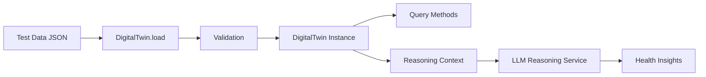

# Design Document: Health Digital Twin

## Overview

The Health Digital Twin is a flexible, schema-agnostic data model designed to represent any person's complete health profile for AI reasoning and analysis. The system uses a hierarchical structure organized by health domains (demographics, biomarkers, medical history, lifestyle, etc.) with explicit handling of missing data and temporal measurements. The primary goal is to provide LLM-based reasoning services with rich, structured health context while gracefully handling incomplete information.

The design emphasizes simplicity and flexibility over rigid schemas, allowing the twin to model diverse health profiles without code changes. All data points include metadata (timestamps, units, field states) to enable sophisticated reasoning about health trends and data quality.

## Architecture

### High-Level Structure

```
HealthDigitalTwin
├── metadata (user_id, created_at, updated_at, version)
├── demographics (age, sex, height, weight, etc.)
├── biomarkers (time-series measurements)
├── medical_history (diagnoses, medications, procedures)
├── lifestyle (diet, exercise, sleep, stress)
├── genetics (optional genetic markers)
└── custom_domains (extensible for new categories)
```

### Core Components

1. **DigitalTwin Class**: Main data structure holding all health domains
2. **HealthDomain**: Container for a category of health data with field state tracking
3. **TimeSeriesMetric**: Temporal measurements with chronological ordering
4. **BiomarkerRegistry**: Metadata repository for known biomarkers
5. **ReasoningContextGenerator**: Serialization engine for LLM consumption
6. **DataValidator**: Validation logic for health metrics

### Data Flow



## Components and Interfaces

### 1. DigitalTwin Class

The main class representing a person's complete health profile.

```python
class DigitalTwin:
    """
    Flexible representation of a person's health data.
    
    Attributes:
        user_id: Unique identifier for the person
        metadata: System metadata (created_at, updated_at, version)
        domains: Dictionary of health domains
        _completeness: Cached completeness statistics
    """
    
    def __init__(self, user_id: str):
        """Initialize an empty digital twin."""
        
    def set_value(self, domain: str, field: str, value: Any, 
                  timestamp: Optional[datetime] = None,
                  unit: Optional[str] = None) -> None:
        """Set a value in a health domain."""
        
    def get_value(self, domain: str, field: str, 
                  latest: bool = True) -> Optional[HealthDataPoint]:
        """Get a value from a health domain."""
        
    def get_time_series(self, domain: str, field: str,
                       start_date: Optional[datetime] = None,
                       end_date: Optional[datetime] = None) -> List[HealthDataPoint]:
        """Get temporal measurements for a field."""
        
    def get_domain(self, domain: str) -> HealthDomain:
        """Get all data for a health domain."""
        
    def get_missing_fields(self, domain: Optional[str] = None) -> List[str]:
        """List all fields marked as missing."""
        
    def calculate_completeness(self) -> Dict[str, float]:
        """Calculate data completeness percentage per domain."""
        
    def to_dict(self) -> Dict[str, Any]:
        """Export complete twin as dictionary."""
        
    def to_reasoning_context(self, max_tokens: Optional[int] = None) -> str:
        """Generate LLM-optimized text representation."""
        
    @classmethod
    def from_dict(cls, data: Dict[str, Any]) -> 'DigitalTwin':
        """Load twin from dictionary."""
```

### 2. HealthDomain Class

Container for a category of health information.

```python
class HealthDomain:
    """
    Represents a category of health data (e.g., biomarkers, demographics).
    
    Attributes:
        name: Domain name
        fields: Dictionary mapping field names to HealthField objects
    """
    
    def __init__(self, name: str):
        """Initialize a health domain."""
        
    def add_field(self, field_name: str, field: 'HealthField') -> None:
        """Add a field to this domain."""
        
    def get_field(self, field_name: str) -> Optional['HealthField']:
        """Get a field by name."""
        
    def list_fields(self, state: Optional[FieldState] = None) -> List[str]:
        """List field names, optionally filtered by state."""
        
    def calculate_completeness(self) -> float:
        """Calculate percentage of populated fields."""
```

### 3. HealthField Class

Represents a single health data field with state tracking.

```python
class FieldState(Enum):
    """State of a health data field."""
    POPULATED = "populated"
    MISSING = "missing"
    NOT_APPLICABLE = "not_applicable"

class HealthField:
    """
    A single health data field with value and metadata.
    
    Attributes:
        name: Field name
        state: Current field state
        data_type: Expected Python type
        values: List of HealthDataPoint objects (for temporal data)
    """
    
    def __init__(self, name: str, data_type: type):
        """Initialize a health field."""
        
    def add_value(self, value: Any, timestamp: datetime,
                  unit: Optional[str] = None) -> None:
        """Add a value with timestamp."""
        
    def get_latest(self) -> Optional['HealthDataPoint']:
        """Get most recent value."""
        
    def get_history(self, start_date: Optional[datetime] = None,
                   end_date: Optional[datetime] = None) -> List['HealthDataPoint']:
        """Get historical values in date range."""
        
    def mark_missing(self) -> None:
        """Mark this field as missing."""
        
    def mark_not_applicable(self) -> None:
        """Mark this field as not applicable."""
```

### 4. HealthDataPoint Class

Individual measurement with metadata.

```python
class HealthDataPoint:
    """
    A single health measurement with metadata.
    
    Attributes:
        value: The measured value
        timestamp: When the measurement was taken
        unit: Unit of measurement
        metadata: Additional context (source, confidence, etc.)
    """
    
    def __init__(self, value: Any, timestamp: datetime,
                 unit: Optional[str] = None,
                 metadata: Optional[Dict[str, Any]] = None):
        """Initialize a data point."""
        
    def to_dict(self) -> Dict[str, Any]:
        """Export as dictionary."""
```

### 5. BiomarkerRegistry Class

Metadata repository for known biomarkers.

```python
class BiomarkerMetadata:
    """
    Metadata for a biomarker.
    
    Attributes:
        name: Biomarker name
        unit: Standard unit of measurement
        reference_range: Normal range (min, max)
        clinical_significance: Description of what this measures
        age_specific_ranges: Optional age-stratified ranges
        sex_specific_ranges: Optional sex-stratified ranges
    """
    pass

class BiomarkerRegistry:
    """
    Registry of known biomarkers with metadata.
    """
    
    def __init__(self):
        """Initialize with common biomarkers."""
        
    def register(self, biomarker: BiomarkerMetadata) -> None:
        """Add a biomarker to the registry."""
        
    def get(self, name: str) -> Optional[BiomarkerMetadata]:
        """Look up biomarker metadata."""
        
    def get_reference_range(self, name: str, age: Optional[int] = None,
                           sex: Optional[str] = None) -> Optional[Tuple[float, float]]:
        """Get reference range for a biomarker."""
        
    def list_all(self) -> List[str]:
        """List all registered biomarkers."""
```

### 6. ReasoningContextGenerator Class

Serialization engine for LLM consumption.

```python
class ReasoningContextGenerator:
    """
    Generates LLM-optimized text representations of digital twins.
    """
    
    def __init__(self, twin: DigitalTwin, registry: BiomarkerRegistry):
        """Initialize with a digital twin and biomarker registry."""
        
    def generate(self, max_tokens: Optional[int] = None,
                include_domains: Optional[List[str]] = None) -> str:
        """Generate formatted text context."""
        
    def _format_demographics(self) -> str:
        """Format demographics section."""
        
    def _format_biomarkers(self) -> str:
        """Format biomarkers with trends and reference ranges."""
        
    def _format_medical_history(self) -> str:
        """Format medical history."""
        
    def _format_completeness_summary(self) -> str:
        """Format data completeness summary."""
        
    def _estimate_tokens(self, text: str) -> int:
        """Estimate token count for text."""
        
    def _truncate_to_fit(self, sections: List[str], max_tokens: int) -> str:
        """Truncate sections to fit token limit."""
```

### 7. DataValidator Class

Validation logic for health metrics.

```python
class ValidationResult:
    """
    Result of data validation.
    
    Attributes:
        is_valid: Whether validation passed
        errors: List of validation errors
        warnings: List of validation warnings
    """
    pass

class DataValidator:
    """
    Validates health data for plausibility and consistency.
    """
    
    def __init__(self, registry: BiomarkerRegistry):
        """Initialize with biomarker registry."""
        
    def validate_biomarker(self, name: str, value: float,
                          age: Optional[int] = None,
                          sex: Optional[str] = None) -> ValidationResult:
        """Validate a biomarker value."""
        
    def validate_temporal_consistency(self, field: HealthField) -> ValidationResult:
        """Validate temporal data consistency."""
        
    def validate_unit(self, biomarker: str, unit: str) -> ValidationResult:
        """Validate unit matches expected unit."""
```

## Data Models

### Core Data Structure

```python
# Example digital twin structure as dictionary
{
    "user_id": "user_123",
    "metadata": {
        "created_at": "2024-01-01T00:00:00Z",
        "updated_at": "2024-01-15T10:30:00Z",
        "version": "1.0"
    },
    "demographics": {
        "age": {
            "state": "populated",
            "data_type": "int",
            "values": [
                {
                    "value": 31,
                    "timestamp": "2024-01-01T00:00:00Z",
                    "unit": "years"
                }
            ]
        },
        "sex": {
            "state": "populated",
            "data_type": "str",
            "values": [
                {
                    "value": "male",
                    "timestamp": "2024-01-01T00:00:00Z"
                }
            ]
        },
        "height": {
            "state": "populated",
            "data_type": "float",
            "values": [
                {
                    "value": 175.0,
                    "timestamp": "2024-01-01T00:00:00Z",
                    "unit": "cm"
                }
            ]
        },
        "weight": {
            "state": "populated",
            "data_type": "float",
            "values": [
                {
                    "value": 75.0,
                    "timestamp": "2024-01-01T00:00:00Z",
                    "unit": "kg"
                },
                {
                    "value": 73.5,
                    "timestamp": "2024-01-15T00:00:00Z",
                    "unit": "kg"
                }
            ]
        }
    },
    "biomarkers": {
        "glucose_fasting": {
            "state": "populated",
            "data_type": "float",
            "values": [
                {
                    "value": 95.0,
                    "timestamp": "2024-01-10T08:00:00Z",
                    "unit": "mg/dL",
                    "metadata": {
                        "reference_range": [70, 100],
                        "clinical_significance": "Fasting blood glucose"
                    }
                }
            ]
        },
        "cholesterol_total": {
            "state": "populated",
            "data_type": "float",
            "values": [
                {
                    "value": 185.0,
                    "timestamp": "2024-01-10T08:00:00Z",
                    "unit": "mg/dL",
                    "metadata": {
                        "reference_range": [125, 200],
                        "clinical_significance": "Total cholesterol"
                    }
                }
            ]
        },
        "hba1c": {
            "state": "missing",
            "data_type": "float",
            "values": []
        }
    },
    "medical_history": {
        "diagnoses": {
            "state": "populated",
            "data_type": "list",
            "values": [
                {
                    "value": ["hypertension"],
                    "timestamp": "2024-01-01T00:00:00Z"
                }
            ]
        },
        "medications": {
            "state": "missing",
            "data_type": "list",
            "values": []
        }
    },
    "lifestyle": {
        "exercise_minutes_per_week": {
            "state": "populated",
            "data_type": "int",
            "values": [
                {
                    "value": 150,
                    "timestamp": "2024-01-01T00:00:00Z",
                    "unit": "minutes"
                }
            ]
        },
        "sleep_hours_per_night": {
            "state": "missing",
            "data_type": "float",
            "values": []
        }
    }
}
```

### Biomarker Registry Structure

```python
# Example biomarker registry
{
    "glucose_fasting": {
        "name": "Fasting Glucose",
        "unit": "mg/dL",
        "reference_range": (70, 100),
        "clinical_significance": "Measures blood sugar after 8-hour fast. Elevated levels indicate diabetes risk.",
        "age_specific_ranges": None,
        "sex_specific_ranges": None
    },
    "cholesterol_total": {
        "name": "Total Cholesterol",
        "unit": "mg/dL",
        "reference_range": (125, 200),
        "clinical_significance": "Measures total cholesterol. High levels increase cardiovascular risk.",
        "age_specific_ranges": {
            (0, 19): (120, 170),
            (20, 39): (125, 200),
            (40, 59): (125, 225),
            (60, 120): (125, 225)
        },
        "sex_specific_ranges": None
    },
    "hba1c": {
        "name": "Hemoglobin A1c",
        "unit": "%",
        "reference_range": (4.0, 5.6),
        "clinical_significance": "Measures average blood sugar over 3 months. Diagnostic for diabetes.",
        "age_specific_ranges": None,
        "sex_specific_ranges": None
    }
}
```

## Correctness Properties

*A property is a characteristic or behavior that should hold true across all valid executions of a system—essentially, a formal statement about what the system should do. Properties serve as the bridge between human-readable specifications and machine-verifiable correctness guarantees.*

### Property 1: Field State Consistency

*For any* digital twin and any field, if the field is marked as populated, then it must have at least one value in its values list.

**Validates: Requirements 2.1, 2.2**

### Property 2: Missing Field Preservation

*For any* digital twin serialization and deserialization cycle, all fields marked as missing in the original twin must remain marked as missing in the deserialized twin.

**Validates: Requirements 2.2, 10.1**

### Property 3: Temporal Ordering

*For any* time-series field with multiple values, the values must be ordered chronologically by timestamp when retrieved.

**Validates: Requirements 3.1, 3.2**

### Property 4: Completeness Calculation Accuracy

*For any* health domain, the calculated completeness percentage must equal the ratio of populated fields to total fields (populated + missing).

**Validates: Requirements 2.3**

### Property 5: Biomarker Validation

*For any* biomarker value that falls within the registered reference range, validation must pass without errors.

**Validates: Requirements 6.1, 6.2**

### Property 6: Unit Consistency

*For any* biomarker with a registered standard unit, storing a value with a different unit must raise a validation error.

**Validates: Requirements 6.4**

### Property 7: Serialization Round-Trip

*For any* digital twin, serializing to dictionary and then deserializing must produce an equivalent twin with the same data.

**Validates: Requirements 10.1**

### Property 8: Query Filtering Correctness

*For any* time-series query with a date range filter, all returned values must have timestamps within the specified range.

**Validates: Requirements 3.4, 9.2**

### Property 9: Missing Fields List Accuracy

*For any* digital twin, the list of missing fields returned by get_missing_fields() must contain exactly those fields marked with state=missing.

**Validates: Requirements 2.4, 9.3**

### Property 10: Reasoning Context Completeness Summary

*For any* digital twin, the reasoning context must include a completeness summary that matches the calculated completeness percentages.

**Validates: Requirements 4.2, 10.2**

### Property 11: Domain Query Isolation

*For any* domain query, the returned data must contain only fields from the specified domain and no fields from other domains.

**Validates: Requirements 9.1**

### Property 12: Latest Value Retrieval

*For any* field with multiple temporal values, get_value(latest=True) must return the value with the most recent timestamp.

**Validates: Requirements 3.3, 8.3**

## Error Handling

### Validation Errors

- **InvalidBiomarkerValue**: Raised when a biomarker value is outside physiologically plausible ranges
- **InvalidUnit**: Raised when a unit doesn't match the expected unit for a biomarker
- **InvalidTimestamp**: Raised when a timestamp is in the future or malformed
- **MissingRequiredField**: Raised when attempting to perform operations requiring a populated field

### Data Loading Errors

- **InvalidDataFormat**: Raised when loading data that doesn't match expected structure
- **TypeMismatch**: Raised when a value doesn't match the declared data type
- **DuplicateField**: Raised when attempting to add a field that already exists

### Query Errors

- **DomainNotFound**: Raised when querying a non-existent domain
- **FieldNotFound**: Raised when querying a non-existent field
- **InvalidDateRange**: Raised when start_date > end_date in temporal queries

## Testing Strategy

### Unit Tests

Unit tests will validate specific examples and edge cases:

- Test loading digital twins from JSON with complete data
- Test loading digital twins with partial/missing data
- Test field state transitions (populated → missing)
- Test temporal data ordering with out-of-order insertions
- Test completeness calculation with various data patterns
- Test biomarker registry lookups with age/sex specificity
- Test validation with edge case values (boundaries, negatives)
- Test reasoning context generation with empty domains
- Test serialization with nested data structures
- Test query filtering with edge dates (start of day, end of day)

### Property-Based Tests

Property-based tests will use Hypothesis to verify universal properties across many generated inputs. Each test will run a minimum of 100 iterations.

**Test Configuration:**
- Library: Hypothesis (Python)
- Minimum iterations: 100 per property
- Tag format: Feature: health-digital-twin, Property {N}: {property_text}

**Property Test Implementations:**

1. **Property 1 Test**: Generate random digital twins with various field states, verify populated fields always have values
2. **Property 2 Test**: Generate random twins, serialize/deserialize, verify missing fields preserved
3. **Property 3 Test**: Generate time-series with random timestamps, verify chronological ordering
4. **Property 4 Test**: Generate domains with random field distributions, verify completeness calculation
5. **Property 5 Test**: Generate biomarker values within reference ranges, verify validation passes
6. **Property 6 Test**: Generate biomarkers with mismatched units, verify validation fails
7. **Property 7 Test**: Generate random twins, verify round-trip serialization equivalence
8. **Property 8 Test**: Generate time-series and random date ranges, verify query filtering
9. **Property 9 Test**: Generate twins with random missing fields, verify get_missing_fields() accuracy
10. **Property 10 Test**: Generate twins, verify reasoning context includes correct completeness summary
11. **Property 11 Test**: Generate multi-domain twins, verify domain queries return only requested domain
12. **Property 12 Test**: Generate time-series with multiple values, verify latest value retrieval

### Test Data

The system will include example test profiles:

- **Healthy Adult**: Complete data, all biomarkers in normal ranges
- **Diabetic Patient**: Elevated glucose, HbA1c, with medication history
- **Cardiovascular Risk**: High cholesterol, blood pressure, family history
- **Incomplete Profile**: 30% data completeness, many missing fields
- **Athlete Profile**: Excellent VO2 max, low resting heart rate, high activity
- **Elderly Patient**: Age-specific reference ranges, multiple medications

Each test profile will be provided as JSON files in `tests/test_data/digital_twins/`.
