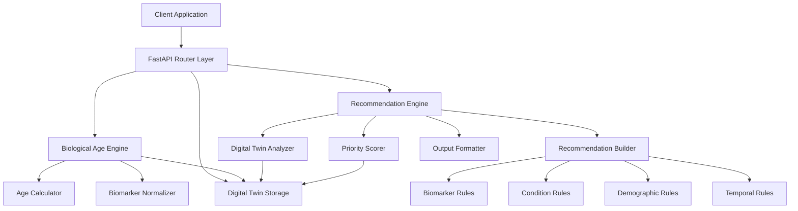

# Design Document: Health Insights AI

## Overview

The Health Insights AI system provides AI-powered analysis of blood reports and health data to generate biological age predictions, personalized recommendations, and actionable health insights. The system leverages the existing Digital Twin infrastructure to store and analyze user health data, applying evidence-based algorithms to calculate biological age and rule-based systems to generate personalized recommendations.

The system is built on FastAPI with async/await support, uses in-memory storage for the MVP phase, and is designed to be horizontally scalable. It integrates with the existing Digital Twin system to provide a comprehensive health analytics platform.

## Architecture

### High-Level Architecture



### Component Layers

1. **API Layer**: FastAPI routers handling HTTP requests
2. **Service Layer**: Business logic engines (Biological Age, Recommendations)
3. **Storage Layer**: In-memory Digital Twin storage
4. **Data Models**: Pydantic models for validation and serialization

### Technology Stack

- **Backend**: Python 3.11 with FastAPI
- **Validation**: Pydantic v2
- **Testing**: pytest with Hypothesis for property-based testing
- **Storage**: In-memory (MVP), PostgreSQL-ready
- **Deployment**: AWS Elastic Beanstalk

## Components and Interfaces

### 1. Biological Age Engine

**Purpose**: Calculate biological age from biomarker data using evidence-based algorithms.

**Key Classes**:
- `BiologicalAgeEngine`: Main orchestrator
- `BiologicalAgeCalculator`: Core calculation logic
- `BiomarkerNormalizer`: Biomarker value normalization

**Public Interface**:
```python
class BiologicalAgeEngine:
    def predict_biological_age(self, digital_twin: DigitalTwin) -> Dict[str, Any]:
        """
        Calculate biological age from digital twin data.
        
        Returns:
            {
                'user_id': str,
                'chronological_age': int,
                'biological_age': float,
                'age_delta': float,
                'confidence_score': int (0-100),
                'category_ages': {
                    'metabolic': float,
                    'cardiovascular': float,
                    'inflammatory': float,
                    'hormonal': float,
                    'organ_function': float
                }
            }
        """
    
    def get_age_insights(self, digital_twin: DigitalTwin) -> Dict[str, Any]:
        """
        Generate detailed insights and recommendations.
        
        Returns:
            {
                'user_id': str,
                'biological_age': float,
                'chronological_age': int,
                'age_delta': float,
                'status': str,
                'confidence': int,
                'category_breakdown': Dict[str, float],
                'recommendations': List[str],
                'data_completeness': float
            }
        """
```

**Algorithm Details**:

The biological age calculation uses weighted category scoring:

```python
CATEGORY_WEIGHTS = {
    'metabolic': 0.25,      # HbA1c, glucose, insulin
    'cardiovascular': 0.25, # Cholesterol, triglycerides, BP
    'inflammatory': 0.20,   # CRP, inflammatory markers
    'hormonal': 0.15,       # Testosterone, thyroid, cortisol
    'organ_function': 0.15  # Kidney, liver function
}
```

Each category calculates an age adjustment based on biomarker values:
- **Metabolic**: Glucose > 100 mg/dL (+3 years), HbA1c > 5.7% (+4 years)
- **Cardiovascular**: Total cholesterol > 240 mg/dL (+5 years), HDL < 40 mg/dL (+4 years)
- **Hormonal**: Testosterone < 300 ng/dL (+3 years), TSH > 4.0 mIU/L (+2 years)
- **Organ Function**: Creatinine > 1.2 mg/dL (+3 years), ALT > 40 U/L (+2 years)

Final biological age = Σ(category_age × category_weight)

### 2. Recommendation Engine

**Purpose**: Generate personalized health recommendations using rule-based evaluation.

**Key Classes**:
- `RecommendationEngine`: Main orchestrator
- `DigitalTwinAnalyzer`: Loads and analyzes user data
- `RecommendationBuilder`: Applies rules to generate recommendations
- `PriorityScorer`: Assigns priority levels
- `OutputFormatter`: Formats final response

**Rule Evaluators**:
- `BiomarkerRules`: Evaluates lab results
- `ConditionRules`: Evaluates medical conditions
- `DemographicRules`: Age/gender-specific screening
- `TemporalRules`: Time-based test scheduling

**Public Interface**:
```python
class RecommendationEngine:
    def generate_recommendations(self, user_id: str) -> RecommendationResponse:
        """
        Generate comprehensive health recommendations.
        
        Returns:
            RecommendationResponse with:
            - summary: counts and categories
            - recommendations: list of Recommendation objects
            - grouped_by_category: recommendations organized by type
        """
```

**Recommendation Model**:
```python
class Recommendation:
    id: str
    test_name: str
    category: str  # blood_test, lifestyle, monitoring
    priority: str  # high, medium, low
    reason: str
    frequency: str  # daily, weekly, monthly, quarterly, annually
    estimated_cost: Optional[str]
    preparation: Optional[str]
    next_due_date: Optional[datetime]
    metadata: Dict[str, Any]
```

### 3. Digital Twin Storage

**Purpose**: Store and manage structured health data across multiple domains.

**Key Classes**:
- `DigitalTwin`: Main data container
- `HealthDomain`: Domain-specific data (biomarkers, medical_history, etc.)
- `HealthField`: Individual field with temporal data points
- `HealthDataPoint`: Single data point with timestamp and metadata

**Public Interface**:
```python
class DigitalTwin:
    def set_value(self, domain: str, field: str, value: Any, 
                  timestamp: Optional[datetime] = None,
                  unit: Optional[str] = None,
                  metadata: Dict[str, Any] = None):
        """Add data to any domain/field"""
    
    def get_value(self, domain: str, field: str, latest: bool = True) -> Union[HealthDataPoint, List[HealthDataPoint], None]:
        """Get value from a specific domain/field"""
    
    def get_domain(self, domain: str) -> Optional[HealthDomain]:
        """Retrieve entire domain"""
    
    def get_overall_completeness(self) -> float:
        """Calculate overall data completeness percentage"""
```

### 4. API Routers

**Biological Age Endpoints**:
- `POST /api/biological-age/users/{user_id}/predict`: Predict biological age
- `POST /api/biological-age/users/{user_id}/insights`: Get detailed insights
- `GET /api/biological-age/users/available`: List users with data
- `POST /api/biological-age/users/all/predict`: Batch prediction

**Recommendation Endpoints**:
- `GET /api/recommendations/{user_id}`: Get personalized recommendations
- `GET /api/recommendations/{user_id}/summary`: Get summary only

**Digital Twin Endpoints**:
- `POST /api/digital-twin/users/{user_id}/create`: Create digital twin
- `POST /api/digital-twin/users/{user_id}/data`: Add health data
- `GET /api/digital-twin/users/{user_id}/data/{domain}/{field}`: Get specific data
- `GET /api/digital-twin/users/{user_id}/completeness`: Get completeness metrics

## Data Models

### Digital Twin Structure

```python
DigitalTwin
├── user_id: str
├── created_at: datetime
├── updated_at: datetime
├── metadata: Dict[str, Any]
└── domains: Dict[str, HealthDomain]
    └── HealthDomain
        ├── domain_name: str
        └── fields: Dict[str, HealthField]
            └── HealthField
                ├── field_name: str
                ├── field_type: str
                ├── state: FieldState (populated/missing/not_applicable)
                └── values: List[HealthDataPoint]
                    └── HealthDataPoint
                        ├── value: Any
                        ├── timestamp: datetime
                        ├── unit: Optional[str]
                        └── metadata: Dict[str, Any]
```

### Biomarker Data Model

Biomarkers are stored in the `biomarkers` domain with the following structure:

```python
{
    "hba1c": {
        "value": 5.8,
        "unit": "%",
        "timestamp": "2024-01-15T10:30:00Z",
        "metadata": {
            "lab": "SRL Diagnostics",
            "test_date": "2024-01-15"
        }
    },
    "total_cholesterol": {
        "value": 195,
        "unit": "mg/dL",
        "timestamp": "2024-01-15T10:30:00Z",
        "metadata": {...}
    }
}
```

### Biological Age Response Model

```python
{
    "user_id": "test_user_1",
    "chronological_age": 35,
    "biological_age": 32.5,
    "age_delta": -2.5,
    "confidence_score": 85,
    "category_ages": {
        "metabolic": 33.0,
        "cardiovascular": 34.0,
        "inflammatory": 31.0,
        "hormonal": 32.0,
        "organ_function": 30.0
    },
    "interpretation": "Your biological age is 2.5 years younger than your chronological age",
    "confidence_level": "high"
}
```

### Recommendation Response Model

```python
{
    "user_id": "test_user_1",
    "generated_at": "2024-01-15T10:30:00Z",
    "summary": {
        "total_recommendations": 12,
        "high_priority_count": 3,
        "medium_priority_count": 6,
        "low_priority_count": 3,
        "categories_covered": ["blood_test", "lifestyle", "monitoring"]
    },
    "recommendations": [
        {
            "id": "rec_001",
            "test_name": "HbA1c Test",
            "category": "blood_test",
            "priority": "high",
            "reason": "HbA1c elevated at 5.8% - monitor glucose control",
            "frequency": "quarterly",
            "estimated_cost": "₹500",
            "preparation": "Fasting not required",
            "next_due_date": "2024-04-15"
        }
    ],
    "grouped_by_category": {
        "blood_test": [...],
        "lifestyle": [...],
        "monitoring": [...]
    }
}
```


## Correctness Properties

*A property is a characteristic or behavior that should hold true across all valid executions of a system—essentially, a formal statement about what the system should do. Properties serve as the bridge between human-readable specifications and machine-verifiable correctness guarantees.*

### Property 1: Minimum Data Requirement for Biological Age

*For any* User with a Digital Twin, biological age calculation should succeed if and only if the user has at least 5 Biomarker values. When insufficient data exists, the system should indicate which additional Biomarkers are needed.

**Validates: Requirements 1.1, 1.4**

### Property 2: Biological Age Calculation Consistency

*For any* User with sufficient Biomarker data, the biological age calculation should use the documented category weights (metabolic: 0.25, cardiovascular: 0.25, inflammatory: 0.20, hormonal: 0.15, organ_function: 0.15) and produce a weighted average of category ages.

**Validates: Requirements 1.2**

### Property 3: Response Completeness

*For any* successful biological age prediction, the response should contain both biological_age and chronological_age fields, along with a confidence score between 0 and 1.

**Validates: Requirements 1.3, 1.5**

### Property 4: Biomarker Extraction Completeness

*For any* Blood_Report uploaded to the system, all Biomarker values present in the report should be extracted and stored in the Digital Twin.

**Validates: Requirements 2.1**

### Property 5: Reference Range Comparison

*For any* extracted Biomarker value, the system should compare it against its Reference_Range and flag it as abnormal if the value falls outside the range.

**Validates: Requirements 2.2, 2.3**

### Property 6: Pattern Detection for Multiple Abnormalities

*For any* User with 2 or more abnormal Biomarkers, the system should identify potential patterns or correlations between the abnormal values.

**Validates: Requirements 2.4**

### Property 7: Recommendation Generation from Abnormal Biomarkers

*For any* User with abnormal Biomarkers, the system should generate targeted Action_Recommendations that reference the specific abnormal values.

**Validates: Requirements 3.1, 3.3**

### Property 8: Recommendation Prioritization and Ordering

*For any* set of generated Action_Recommendations, they should be ordered by priority (high before medium before low) and limited to the top 5 most impactful actions.

**Validates: Requirements 3.2, 3.4, 7.3**

### Property 9: Recommendation Categorization

*For any* Action_Recommendation generated, it should have a category field with a value from the set {diet, exercise, lifestyle, medical consultation, blood_test, monitoring}.

**Validates: Requirements 3.5**

### Property 10: Trend Detection with Multiple Reports

*For any* User with 2 or more Blood_Reports, the system should identify trends in Biomarker values and calculate the rate of change per month for key Biomarkers.

**Validates: Requirements 4.1, 4.4**

### Property 11: Improvement and Deterioration Detection

*For any* Biomarker with multiple values over time, if the value improves by 10% or more, the system should highlight the positive trend; if it deteriorates by 10% or more, the system should alert with high priority.

**Validates: Requirements 4.2, 4.3**

### Property 12: Risk Assessment Coverage

*For any* User with Biomarker data, risk assessment should evaluate cardiovascular disease, diabetes, and metabolic syndrome, using at least 3 Biomarkers and their interactions.

**Validates: Requirements 5.1, 5.4**

### Property 13: Risk Level Classification

*For any* identified health risk, the system should provide a risk level from the set {low, moderate, high}, and when high risk is detected, should include a medical consultation recommendation.

**Validates: Requirements 5.2, 5.3**

### Property 14: Risk Explanation Completeness

*For any* completed risk assessment, the explanation should reference which specific Biomarkers contribute to the risk.

**Validates: Requirements 5.5**

### Property 15: Biomarker Explanation in Insights

*For any* Insight that references a Biomarker, the output should include an explanation of what the Biomarker measures.

**Validates: Requirements 7.2**

### Property 16: Insight Contextualization

*For any* Insight that requires context, the system should provide relevant background information, and when insights contain more than 3 key points, they should be broken into digestible sections.

**Validates: Requirements 7.4, 7.5**

### Property 17: Model Versioning and Logging

*For any* prediction made by the system, the logs should include the model version (in semantic versioning format) and confidence score.

**Validates: Requirements 8.1, 8.3**

## Error Handling

### Error Categories

1. **Insufficient Data Errors**
   - Missing required fields (age, minimum biomarkers)
   - Response: HTTP 400 with specific missing fields listed
   - Example: `{"error": "Insufficient data", "missing_fields": ["age", "hba1c"]}`

2. **Invalid Data Errors**
   - Biomarker values outside physically possible ranges
   - Invalid units or data types
   - Response: HTTP 400 with validation details
   - Example: `{"error": "Invalid biomarker value", "field": "hba1c", "value": -5, "reason": "Value must be positive"}`

3. **User Not Found Errors**
   - Digital twin doesn't exist for user_id
   - Response: HTTP 404
   - Example: `{"error": "User not found", "user_id": "unknown_user"}`

4. **Calculation Errors**
   - Unexpected errors during biological age calculation
   - Response: HTTP 500 with error tracking ID
   - Example: `{"error": "Calculation failed", "tracking_id": "err_12345"}`

### Error Handling Strategy

```python
try:
    result = engine.predict_biological_age(digital_twin)
except ValueError as e:
    # Missing or invalid data
    return JSONResponse(
        status_code=400,
        content={"error": str(e), "type": "validation_error"}
    )
except KeyError as e:
    # User not found
    return JSONResponse(
        status_code=404,
        content={"error": "User not found", "user_id": user_id}
    )
except Exception as e:
    # Unexpected errors
    logger.error(f"Unexpected error: {str(e)}", exc_info=True)
    return JSONResponse(
        status_code=500,
        content={"error": "Internal server error", "tracking_id": generate_tracking_id()}
    )
```

### Graceful Degradation

When partial data is available:
- Calculate biological age with available categories
- Reduce confidence score proportionally
- Indicate which categories are missing
- Provide recommendations for data collection

Example:
```python
{
    "biological_age": 35.2,
    "confidence_score": 0.6,
    "missing_categories": ["inflammatory", "hormonal"],
    "recommendation": "Add CRP and TSH tests for more accurate assessment"
}
```

## Testing Strategy

### Dual Testing Approach

The system will use both unit tests and property-based tests to ensure comprehensive coverage:

- **Unit tests**: Verify specific examples, edge cases, and error conditions
- **Property tests**: Verify universal properties across all inputs using Hypothesis

Both testing approaches are complementary and necessary for comprehensive coverage. Unit tests catch concrete bugs with specific examples, while property tests verify general correctness across many randomly generated inputs.

### Property-Based Testing Configuration

**Library**: Hypothesis (Python property-based testing library)

**Configuration**:
- Minimum 100 iterations per property test
- Each test tagged with feature name and property number
- Tag format: `# Feature: health-insights-ai, Property N: [property text]`

**Example Property Test**:
```python
from hypothesis import given, strategies as st
import pytest

@given(
    age=st.integers(min_value=18, max_value=100),
    biomarker_count=st.integers(min_value=0, max_value=20)
)
def test_minimum_data_requirement(age, biomarker_count):
    """
    Feature: health-insights-ai, Property 1: Minimum Data Requirement for Biological Age
    
    For any User with a Digital Twin, biological age calculation should succeed 
    if and only if the user has at least 5 Biomarker values.
    """
    twin = create_digital_twin_with_biomarkers(age, biomarker_count)
    engine = BiologicalAgeEngine()
    
    if biomarker_count >= 5:
        # Should succeed
        result = engine.predict_biological_age(twin)
        assert result['biological_age'] is not None
        assert result['confidence_score'] >= 0
    else:
        # Should fail with helpful error
        with pytest.raises(ValueError) as exc_info:
            engine.predict_biological_age(twin)
        assert "additional biomarkers" in str(exc_info.value).lower()
```

### Unit Testing Strategy

**Test Organization**:
```
tests/
├── unit/
│   ├── biological_age/
│   │   ├── test_calculator.py
│   │   ├── test_engine.py
│   │   └── test_normalizer.py
│   └── recommendations/
│       ├── test_engine.py
│       ├── test_rules.py
│       └── test_priority_scorer.py
├── property/
│   ├── biological_age/
│   │   ├── test_properties.py
│   │   └── test_generators.py
│   └── recommendations/
│       └── test_properties.py
└── integration/
    ├── test_api_endpoints.py
    └── test_full_workflow.py
```

**Unit Test Examples**:

1. **Specific Example Tests**:
```python
def test_biological_age_with_optimal_biomarkers():
    """Test biological age calculation with optimal biomarker values"""
    twin = DigitalTwin(user_id="test")
    twin.set_value("demographics", "age", 35)
    twin.set_value("biomarkers", "hba1c", 5.2, unit="%")
    twin.set_value("biomarkers", "total_cholesterol", 180, unit="mg/dL")
    twin.set_value("biomarkers", "hdl_cholesterol", 65, unit="mg/dL")
    twin.set_value("biomarkers", "triglycerides", 90, unit="mg/dL")
    twin.set_value("biomarkers", "creatinine", 0.9, unit="mg/dL")
    
    engine = BiologicalAgeEngine()
    result = engine.predict_biological_age(twin)
    
    # With optimal values, biological age should be younger
    assert result['biological_age'] < result['chronological_age']
    assert result['confidence_score'] > 80
```

2. **Edge Case Tests**:
```python
def test_biological_age_with_extreme_values():
    """Test handling of extreme biomarker values"""
    twin = DigitalTwin(user_id="test")
    twin.set_value("demographics", "age", 35)
    twin.set_value("biomarkers", "hba1c", 12.0, unit="%")  # Very high
    twin.set_value("biomarkers", "total_cholesterol", 350, unit="mg/dL")  # Very high
    
    engine = BiologicalAgeEngine()
    result = engine.predict_biological_age(twin)
    
    # Should handle extreme values without crashing
    assert result['biological_age'] > result['chronological_age']
    assert result['biological_age'] < 150  # Reasonable upper bound
```

3. **Error Condition Tests**:
```python
def test_biological_age_without_age():
    """Test error handling when age is missing"""
    twin = DigitalTwin(user_id="test")
    # No age set
    twin.set_value("biomarkers", "hba1c", 5.8, unit="%")
    
    engine = BiologicalAgeEngine()
    
    with pytest.raises(ValueError) as exc_info:
        engine.predict_biological_age(twin)
    
    assert "age" in str(exc_info.value).lower()
```

### Integration Testing

Test complete workflows:
```python
async def test_full_biological_age_workflow():
    """Test complete workflow from digital twin creation to biological age prediction"""
    # 1. Create digital twin
    response = await client.post("/api/digital-twin/users/test_user/create")
    assert response.status_code == 200
    
    # 2. Add biomarker data
    biomarkers = [
        {"domain": "biomarkers", "field": "hba1c", "value": 5.8, "unit": "%"},
        {"domain": "biomarkers", "field": "total_cholesterol", "value": 195, "unit": "mg/dL"},
        # ... more biomarkers
    ]
    
    for biomarker in biomarkers:
        response = await client.post("/api/digital-twin/users/test_user/data", json=biomarker)
        assert response.status_code == 200
    
    # 3. Predict biological age
    response = await client.post("/api/biological-age/users/test_user/predict")
    assert response.status_code == 200
    
    data = response.json()
    assert "biological_age" in data
    assert "confidence_score" in data
    assert data['confidence_score'] > 0
```

### Test Coverage Goals

- **Unit Test Coverage**: > 80% line coverage
- **Property Test Coverage**: All correctness properties implemented
- **Integration Test Coverage**: All API endpoints tested
- **Edge Case Coverage**: Boundary values, empty data, extreme values

### Running Tests

```bash
# Run all tests
pytest

# Run unit tests only
pytest tests/unit/

# Run property-based tests only
pytest tests/property/

# Run with coverage
pytest --cov=app --cov-report=html

# Run specific property test with verbose output
pytest tests/property/biological_age/test_properties.py::test_minimum_data_requirement -v
```
