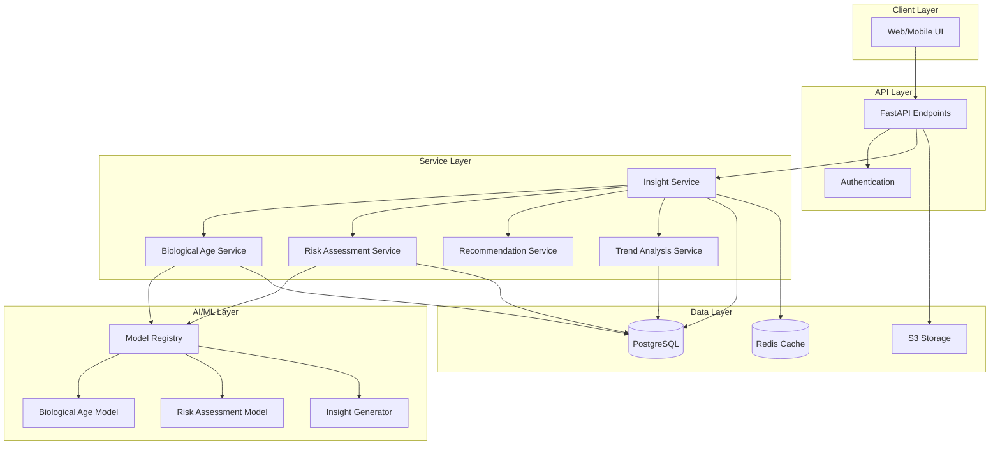

# Design Document: Health Insights AI

## Overview

The Health Insights AI system provides intelligent analysis of health data, particularly blood reports, to generate biological age predictions, personalized recommendations, and actionable insights. The system integrates with the existing document processing pipeline and extends it with AI-powered analysis capabilities.

The design follows a modular architecture where AI models are decoupled from the core application logic, allowing for independent model updates and A/B testing. The system processes biomarker data extracted from blood reports, applies machine learning models for predictions and risk assessment, and generates human-readable insights with recommendations.

## Architecture

### High-Level Architecture



### Design Principles

1. **Separation of Concerns**: AI models are isolated from business logic
2. **Extensibility**: New models and insights can be added without modifying core services
3. **Performance**: Caching strategies for expensive AI computations
4. **Versioning**: All AI models are versioned for reproducibility and rollback
5. **Privacy**: Health data never leaves the system; models run on-premise or in secure cloud

## Components and Interfaces

### 1. Insight Service

The main orchestrator that coordinates all AI-powered analysis.

```python
class InsightService:
    """
    Orchestrates health insight generation from biomarker data.
    """
    
    async def generate_insights(
        self,
        user_id: str,
        document_id: str
    ) -> HealthInsights:
        """
        Generate comprehensive health insights for a user's blood report.
        
        Args:
            user_id: User identifier
            document_id: Document containing biomarker data
            
        Returns:
            HealthInsights object containing all analysis results
        """
        pass
    
    async def get_cached_insights(
        self,
        user_id: str,
        document_id: str
    ) -> Optional[HealthInsights]:
        """
        Retrieve cached insights if available and not stale.
        """
        pass
```

### 2. Biological Age Service

Calculates biological age from biomarker data.

```python
class BiologicalAgeService:
    """
    Calculates biological age using validated biomarker correlations.
    """
    
    async def calculate_biological_age(
        self,
        biomarkers: List[BiomarkerData],
        chronological_age: int
    ) -> BiologicalAgeResult:
        """
        Calculate biological age from biomarker values.
        
        Args:
            biomarkers: List of biomarker measurements
            chronological_age: User's actual age in years
            
        Returns:
            BiologicalAgeResult with prediction and confidence
        """
        pass
    
    def get_required_biomarkers(self) -> List[str]:
        """
        Return list of biomarker names required for calculation.
        """
        pass
    
    def check_sufficiency(
        self,
        biomarkers: List[BiomarkerData]
    ) -> SufficiencyCheck:
        """
        Check if provided biomarkers are sufficient for calculation.
        
        Returns:
            SufficiencyCheck indicating if sufficient and what's missing
        """
        pass
```

### 3. Risk Assessment Service

Evaluates health risks based on biomarker patterns.

```python
class RiskAssessmentService:
    """
    Assesses health risks from biomarker data.
    """
    
    async def assess_risks(
        self,
        biomarkers: List[BiomarkerData],
        user_profile: UserProfile
    ) -> List[RiskAssessment]:
        """
        Assess health risks for common conditions.
        
        Args:
            biomarkers: Current biomarker measurements
            user_profile: User demographics and history
            
        Returns:
            List of risk assessments for various conditions
        """
        pass
    
    def calculate_condition_risk(
        self,
        condition: str,
        biomarkers: List[BiomarkerData]
    ) -> RiskLevel:
        """
        Calculate risk level for a specific condition.
        """
        pass
```

### 4. Recommendation Service

Generates personalized action recommendations.

```python
class RecommendationService:
    """
    Generates personalized health recommendations.
    """
    
    async def generate_recommendations(
        self,
        biomarkers: List[BiomarkerData],
        risks: List[RiskAssessment],
        user_preferences: Optional[UserPreferences] = None
    ) -> List[ActionRecommendation]:
        """
        Generate prioritized recommendations based on analysis.
        
        Args:
            biomarkers: Current biomarker measurements
            risks: Identified health risks
            user_preferences: Optional user preferences for recommendations
            
        Returns:
            List of up to 5 prioritized recommendations
        """
        pass
    
    def prioritize_recommendations(
        self,
        recommendations: List[ActionRecommendation]
    ) -> List[ActionRecommendation]:
        """
        Sort recommendations by health impact and urgency.
        """
        pass
```

### 5. Trend Analysis Service

Analyzes changes in biomarkers over time.

```python
class TrendAnalysisService:
    """
    Analyzes biomarker trends across multiple reports.
    """
    
    async def analyze_trends(
        self,
        user_id: str,
        biomarker_name: str,
        time_range: Optional[TimeRange] = None
    ) -> BiomarkerTrend:
        """
        Analyze trend for a specific biomarker.
        
        Args:
            user_id: User identifier
            biomarker_name: Name of biomarker to analyze
            time_range: Optional time range for analysis
            
        Returns:
            BiomarkerTrend with direction, rate, and significance
        """
        pass
    
    async def get_all_trends(
        self,
        user_id: str
    ) -> List[BiomarkerTrend]:
        """
        Get trends for all biomarkers with multiple measurements.
        """
        pass
```

### 6. Model Registry

Manages AI model versions and deployment.

```python
class ModelRegistry:
    """
    Manages AI model lifecycle and versioning.
    """
    
    def get_model(
        self,
        model_type: str,
        version: Optional[str] = None
    ) -> AIModel:
        """
        Retrieve a specific model version.
        
        Args:
            model_type: Type of model (biological_age, risk_assessment, etc.)
            version: Specific version or None for latest
            
        Returns:
            Loaded AI model ready for inference
        """
        pass
    
    def register_model(
        self,
        model_type: str,
        version: str,
        model_path: str,
        metadata: ModelMetadata
    ) -> bool:
        """
        Register a new model version.
        """
        pass
    
    def get_active_experiments(self) -> List[ABTest]:
        """
        Get list of active A/B tests for model comparison.
        """
        pass
```

## Data Models

### HealthInsights

```python
class HealthInsights(BaseModel):
    """Complete health insights for a user."""
    
    user_id: str
    document_id: str
    generated_at: datetime
    
    biological_age: Optional[BiologicalAgeResult]
    risk_assessments: List[RiskAssessment]
    recommendations: List[ActionRecommendation]
    trends: List[BiomarkerTrend]
    key_findings: List[str]
    
    model_versions: Dict[str, str]  # Track which models generated insights
```

### BiologicalAgeResult

```python
class BiologicalAgeResult(BaseModel):
    """Result of biological age calculation."""
    
    biological_age: float
    chronological_age: int
    age_difference: float  # biological - chronological
    confidence_score: float  # 0-1
    
    contributing_biomarkers: List[str]
    missing_biomarkers: List[str]
    
    interpretation: str  # Human-readable explanation
```

### RiskAssessment

```python
class RiskLevel(str, Enum):
    LOW = "low"
    MODERATE = "moderate"
    HIGH = "high"


class RiskAssessment(BaseModel):
    """Risk assessment for a specific condition."""
    
    condition: str  # e.g., "cardiovascular_disease", "type_2_diabetes"
    risk_level: RiskLevel
    risk_score: float  # 0-1 continuous score
    
    contributing_factors: List[str]  # Biomarkers contributing to risk
    protective_factors: List[str]  # Biomarkers reducing risk
    
    explanation: str  # Why this risk level was assigned
    requires_medical_consultation: bool
```

### ActionRecommendation

```python
class RecommendationType(str, Enum):
    DIET = "diet"
    EXERCISE = "exercise"
    LIFESTYLE = "lifestyle"
    MEDICAL_CONSULTATION = "medical_consultation"
    SUPPLEMENT = "supplement"


class ActionRecommendation(BaseModel):
    """Personalized action recommendation."""
    
    id: str
    title: str
    description: str
    category: RecommendationType
    
    priority: int  # 1-5, with 1 being highest
    impact_score: float  # Expected health impact (0-1)
    
    rationale: str  # Why this recommendation based on user's data
    related_biomarkers: List[str]
    related_risks: List[str]
    
    actionable_steps: List[str]  # Specific steps to take
```

### BiomarkerTrend

```python
class TrendDirection(str, Enum):
    IMPROVING = "improving"
    STABLE = "stable"
    DETERIORATING = "deteriorating"


class BiomarkerTrend(BaseModel):
    """Trend analysis for a biomarker over time."""
    
    biomarker_name: str
    direction: TrendDirection
    
    rate_of_change: float  # Units per month
    statistical_significance: float  # p-value
    
    data_points: List[TrendDataPoint]
    
    interpretation: str  # Human-readable trend explanation
```

### TrendDataPoint

```python
class TrendDataPoint(BaseModel):
    """Single data point in a trend."""
    
    date: date
    value: float
    unit: str
    document_id: str
```

### ModelMetadata

```python
class ModelMetadata(BaseModel):
    """Metadata for AI model versions."""
    
    model_type: str
    version: str
    created_at: datetime
    
    training_data_info: str
    performance_metrics: Dict[str, float]
    
    required_features: List[str]
    output_schema: Dict[str, Any]
    
    is_active: bool
    deployment_date: Optional[datetime]
```

## Correctness Properties


A property is a characteristic or behavior that should hold true across all valid executions of a system—essentially, a formal statement about what the system should do. Properties serve as the bridge between human-readable specifications and machine-verifiable correctness guarantees.

### Property 1: Biological Age Calculation Completeness

*For any* user with sufficient biomarker data, the biological age calculation result SHALL include biological age, chronological age, confidence score (0-1), contributing biomarkers, and missing biomarkers.

**Validates: Requirements 1.1, 1.3, 1.5**

### Property 2: Insufficient Data Handling

*For any* biomarker dataset that is insufficient for biological age calculation, the system SHALL return a list of missing required biomarkers.

**Validates: Requirements 1.4**

### Property 3: Biological Age Bounds

*For any* calculated biological age, the value SHALL be within reasonable bounds (0 to 150 years) and the confidence score SHALL be between 0 and 1 inclusive.

**Validates: Requirements 1.2**

### Property 4: Abnormal Biomarker Flagging

*For any* biomarker with a defined reference range, if the value is outside the range (value < reference_range_low OR value > reference_range_high), then is_abnormal SHALL be true.

**Validates: Requirements 2.3**

### Property 5: Analysis Summary Generation

*For any* completed biomarker analysis, the system SHALL generate a HealthInsights object containing risk assessments, recommendations, and key findings lists (may be empty but must be present).

**Validates: Requirements 2.5**

### Property 6: Pattern Detection for Multiple Abnormalities

*For any* analysis with two or more abnormal biomarkers, the system SHALL attempt pattern identification and include findings in the key_findings list.

**Validates: Requirements 2.4**

### Property 7: Recommendation Generation from Abnormalities

*For any* set of abnormal biomarkers, the system SHALL generate at least one recommendation that references at least one of those abnormal biomarkers in its related_biomarkers field.

**Validates: Requirements 3.1**

### Property 8: Recommendation Limit

*For any* recommendation generation, the returned list SHALL contain at most 5 recommendations.

**Validates: Requirements 3.4**

### Property 9: Recommendation Prioritization

*For any* list of recommendations, they SHALL be ordered by priority (ascending, where 1 is highest) and SHALL have valid category values from the RecommendationType enum.

**Validates: Requirements 3.2, 3.5**

### Property 10: Recommendation Completeness

*For any* recommendation, it SHALL include title, description, category, priority, rationale, and actionable_steps (list may be empty but must be present).

**Validates: Requirements 3.3**

### Property 11: Trend Identification

*For any* user with multiple blood reports containing the same biomarker, the system SHALL calculate a trend with direction, rate of change, and data points.

**Validates: Requirements 4.1, 4.4**

### Property 12: Trend Direction Accuracy

*For any* biomarker trend where the most recent value is higher than the oldest value and the biomarker is "higher is better" (e.g., HDL cholesterol), the direction SHALL be "improving"; conversely, if "lower is better" (e.g., LDL cholesterol) and recent value is lower, direction SHALL be "improving".

**Validates: Requirements 4.2**

### Property 13: Deteriorating Trend Priority

*For any* biomarker with direction "deteriorating", there SHALL exist at least one recommendation related to that biomarker with priority <= 3 (high priority).

**Validates: Requirements 4.3**

### Property 14: Risk Assessment Completeness

*For any* biomarker analysis, the system SHALL generate risk assessments for at least the following conditions: cardiovascular_disease, type_2_diabetes, metabolic_syndrome.

**Validates: Requirements 5.1**

### Property 15: Risk Level Validity

*For any* risk assessment, the risk_level SHALL be one of LOW, MODERATE, or HIGH, and risk_score SHALL be between 0 and 1 inclusive.

**Validates: Requirements 5.2**

### Property 16: High Risk Medical Consultation

*For any* risk assessment with risk_level HIGH, there SHALL exist a recommendation with category MEDICAL_CONSULTATION that references the same condition.

**Validates: Requirements 5.3**

### Property 17: Multi-Biomarker Risk Assessment

*For any* risk assessment, the contributing_factors list SHALL contain at least one biomarker name, demonstrating that multiple biomarkers are considered.

**Validates: Requirements 5.4, 5.5**

### Property 18: Data Deletion Completeness

*For any* user data deletion request, after completion, querying for that user's health insights, biomarker data, and documents SHALL return empty results or not found errors.

**Validates: Requirements 6.4**

### Property 19: Biomarker Explanation in Insights

*For any* insight or recommendation that references a biomarker in its related_biomarkers field, the system SHALL provide access to a biomarker explanation (either inline or via reference).

**Validates: Requirements 7.2**

### Property 20: Model Version Tracking

*For any* HealthInsights object, the model_versions dictionary SHALL contain entries for all models used (biological_age, risk_assessment, etc.) with their version strings.

**Validates: Requirements 8.1, 8.3**

## Error Handling

### Error Categories

1. **Validation Errors**: Invalid input data (malformed biomarkers, missing required fields)
2. **Insufficient Data Errors**: Not enough biomarkers for analysis
3. **Model Errors**: AI model failures or unavailability
4. **Data Access Errors**: Database or cache failures
5. **Authentication Errors**: Unauthorized access attempts

### Error Response Format

All errors follow a consistent format:

```python
class ErrorResponse(BaseModel):
    error_code: str
    message: str
    details: Optional[Dict[str, Any]]
    timestamp: datetime
```

### Specific Error Handling

**Insufficient Biomarker Data**:
- Return HTTP 422 with error code `INSUFFICIENT_DATA`
- Include list of missing required biomarkers in details
- Allow partial results where possible (e.g., risk assessment without biological age)

**Model Unavailability**:
- Return HTTP 503 with error code `MODEL_UNAVAILABLE`
- Log error for monitoring
- Attempt fallback to previous model version if available

**Invalid Biomarker Values**:
- Return HTTP 400 with error code `INVALID_BIOMARKER`
- Specify which biomarker and what validation failed
- Continue processing valid biomarkers

**Authentication Failures**:
- Return HTTP 401 for missing/invalid tokens
- Return HTTP 403 for insufficient permissions
- Never expose user data in error messages

### Graceful Degradation

The system is designed to provide partial results when complete analysis is not possible:

1. If biological age cannot be calculated, still provide risk assessments and recommendations
2. If one risk model fails, continue with other risk assessments
3. If trend analysis fails, still provide current biomarker analysis
4. Cache partial results to avoid recomputation

## Testing Strategy

### Dual Testing Approach

The system will be validated using both unit tests and property-based tests:

- **Unit tests**: Verify specific examples, edge cases, and error conditions
- **Property tests**: Verify universal properties across all inputs
- Both approaches are complementary and necessary for comprehensive coverage

### Property-Based Testing

We will use **Hypothesis** (Python's property-based testing library) to validate correctness properties.

**Configuration**:
- Minimum 100 iterations per property test
- Each test tagged with format: `# Feature: health-insights-ai, Property {N}: {property_text}`
- Custom generators for domain objects (BiomarkerData, UserProfile, etc.)

**Test Organization**:
```
tests/
  property/
    test_biological_age_props.py
    test_risk_assessment_props.py
    test_recommendations_props.py
    test_trends_props.py
    test_data_models_props.py
```

**Example Property Test Structure**:

```python
from hypothesis import given, settings
from hypothesis import strategies as st

@settings(max_examples=100)
@given(biomarkers=st.lists(biomarker_strategy(), min_size=5))
def test_biological_age_completeness(biomarkers):
    """
    Feature: health-insights-ai, Property 1: Biological Age Calculation Completeness
    
    For any user with sufficient biomarker data, the biological age 
    calculation result SHALL include all required fields.
    """
    result = calculate_biological_age(biomarkers, chronological_age=30)
    
    assert result.biological_age is not None
    assert result.chronological_age == 30
    assert 0 <= result.confidence_score <= 1
    assert isinstance(result.contributing_biomarkers, list)
    assert isinstance(result.missing_biomarkers, list)
```

### Unit Testing

Unit tests focus on:

1. **Specific Examples**: Known biomarker values with expected outcomes
2. **Edge Cases**: Empty lists, boundary values, extreme ages
3. **Error Conditions**: Invalid inputs, missing data, model failures
4. **Integration Points**: Service interactions, database operations

**Test Organization**:
```
tests/
  unit/
    test_insight_service.py
    test_biological_age_service.py
    test_risk_assessment_service.py
    test_recommendation_service.py
    test_trend_analysis_service.py
    test_model_registry.py
```

### Integration Testing

Integration tests verify:
- End-to-end flow from document upload to insight generation
- Database persistence and retrieval
- Cache behavior
- Model registry integration
- API endpoint responses

### Performance Testing

Key performance targets:
- Biological age calculation: < 500ms
- Full insight generation: < 2 seconds
- Trend analysis: < 1 second
- Cache hit rate: > 80% for repeated queries

### Test Data Strategy

**Synthetic Data Generation**:
- Use Hypothesis strategies to generate valid biomarker data
- Create realistic reference ranges based on medical literature
- Generate edge cases automatically (very high/low values, missing data)

**Real-World Test Data**:
- Anonymized blood report samples for integration testing
- Known good/bad examples for validation
- Never use real user data in tests

### Continuous Testing

- All tests run on every commit
- Property tests run with reduced iterations (50) in CI, full (100) locally
- Performance tests run nightly
- Integration tests run on staging environment before production deployment
