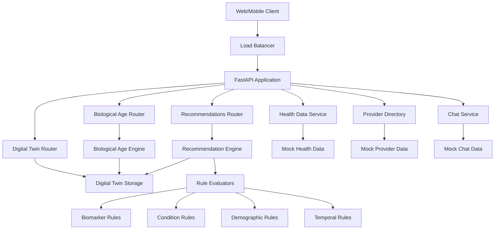

# Aarogyadost Backend API - Architecture Overview

## 🏗️ System Architecture

### Platform & Infrastructure
- **Cloud Provider**: AWS
- **Deployment**: Elastic Beanstalk (ap-south-1 Mumbai)
- **Runtime**: Python 3.11 on Amazon Linux 2023
- **Instance Type**: t3.micro (Free Tier)
- **Framework**: FastAPI with async/await support
- **Data Storage**: In-memory digital twins + S3 for documents
- **Testing**: pytest with Hypothesis for property-based testing

### Environments
| Environment | Domain | Status |
|-------------|--------|--------|
| **Development** | https://api-dev.arogyadost.in | ✅ Active |
| **Production** | https://api.arogyadost.in | ✅ Active |

## 🔐 Security & SSL
- **HTTPS**: Full SSL encryption with wildcard certificate (*.arogyadost.in)
- **Mixed Content**: Resolved for secure web app integration

## 🚀 CI/CD Pipeline
- **Dev Branch** → Auto-deploy to Development
- **Main Branch** → Auto-deploy to Production
- **GitHub Actions**: Automated deployment workflow

## 📡 API Endpoints Overview

### Digital Twin Management
```
POST /api/digital-twin/users/{user_id}/create           # Create digital twin
POST /api/digital-twin/users/{user_id}/data             # Add health data
GET  /api/digital-twin/users/{user_id}/data/{domain}/{field}  # Get specific data
GET  /api/digital-twin/users/{user_id}/domains/{domain} # Get domain data
GET  /api/digital-twin/users/{user_id}/missing-fields   # Get missing fields
GET  /api/digital-twin/users/{user_id}/completeness     # Get data completeness
GET  /api/digital-twin/users/{user_id}/profile          # Get complete profile
```

### Biological Age Prediction
```
POST /api/biological-age/users/{user_id}/predict        # Predict biological age
POST /api/biological-age/users/{user_id}/insights       # Get age insights
GET  /api/biological-age/users/available                # List available users
POST /api/biological-age/users/all/predict              # Predict all users
GET  /api/biological-age/health                         # Service health check
```

### Health Recommendations
```
GET /api/recommendations/{user_id}                      # Get personalized recommendations
GET /api/recommendations/{user_id}/summary              # Get recommendations summary
```

### User Management (CRUD)
```
POST   /api/users/                                      # Create new user with digital twin
GET    /api/users/                                      # List all users
PUT    /api/users/select                                # Select/switch active user
GET    /api/users/{user_id}                             # Get user by ID
DELETE /api/users/{user_id}                             # Delete user
PUT    /api/users/{user_id}/display-name                # Update display name
GET    /api/users/stats/overview                        # Get user statistics
```

### Database API
```
GET  /api/db/users                                      # Get all users from database
GET  /api/db/users/{user_id}                            # Get user from database
GET  /api/db/users/{user_id}/biomarkers                 # Get biomarkers by category
GET  /api/db/users/{user_id}/medical-history            # Get medical history
GET  /api/db/users/{user_id}/full                       # Get complete user data
GET  /api/db/users/{user_id}/routines                   # Get auto-computed routines
GET  /api/db/users/{user_id}/health-scores              # Get computed health scores
POST /api/db/users/{user_id}/recompute                  # Force recompute derived data
```

### Health Check API
```
GET /api/health/database                                # Database connectivity check
GET /api/health/storage                                 # Storage layer health
GET /api/health/digital-brain                           # Overall digital brain health
```

### Health Data Management (Legacy Mock Data)
```
GET /api/health/biomarkers     # Health categories & scores
GET /api/health/recommendations # Recommended actions
GET /api/health/metrics        # Health metrics data
GET /api/health/status         # Overall health status
GET /api/biomarkers/{id}       # Detailed biomarker info
```

### Healthcare Provider Directory
```
GET /api/doctors               # List of doctors
GET /api/doctors/{id}          # Doctor profile details
GET /api/labs                  # List of laboratories
GET /api/labs/{id}             # Lab details & services
```

### Medical Files Management
```
GET  /api/medical-files/categories              # Get file categories
GET  /api/medical-files/specialties             # Get medical specialties
GET  /api/medical-files/by-specialty/{specialty} # Get files by specialty
GET  /api/medical-files/by-category/{category}  # Get files by category
GET  /api/medical-files                         # Get all files (with filters)
GET  /api/medical-files/{file_id}               # Get file details
POST /api/medical-files/upload                  # Upload medical file
```

### Communication System
```
GET /api/chat/threads          # User chat history
POST /api/chat/message         # Send new message (with file context)
```

## 🎯 Key Features

### Digital Twin System
- **Structured Health Data**: Multi-domain health data storage (demographics, biomarkers, medical history, lifestyle, genetics)
- **Temporal Tracking**: Historical data points with timestamps
- **Data Completeness**: Track missing fields and completeness percentages
- **Flexible Schema**: Dynamic field addition and state management

### Biological Age Prediction
- **Evidence-Based Calculation**: Multi-category age assessment (metabolic, cardiovascular, inflammatory, hormonal, organ function)
- **Weighted Scoring**: Category-specific weights based on longevity research
- **Confidence Metrics**: Data quality and completeness scoring
- **Detailed Insights**: Category-level age breakdowns and recommendations

### Health Recommendations Engine
- **Rule-Based System**: Biomarker, condition, demographic, and temporal rules
- **Priority Scoring**: High/medium/low priority assignment
- **Category Grouping**: Organized by health domains
- **Personalized Output**: User-specific recommendations based on digital twin data

### Health Analytics
- **Biomarker Tracking**: Comprehensive health data analysis
- **Personalized Recommendations**: AI-driven health suggestions
- **Status Monitoring**: Real-time health status updates
- **Longevity Focus**: Biological age assessment and optimization

### Medical Document Management
- **File Organization**: Specialty and category-based organization
- **OCR Processing**: Automated text extraction from medical documents
- **AI Analysis**: Intelligent summary and key findings extraction
- **Context-Aware Chat**: File-specific health guidance

### Provider Network
- **Doctor Directory**: Searchable healthcare provider database
- **Lab Services**: Laboratory network integration
- **Detailed Profiles**: Complete provider information

### Patient Communication
- **Chat System**: Threaded messaging capability
- **File Context**: Document-aware AI responses
- **Message History**: Persistent conversation tracking

## 📊 Technical Specifications

### API Documentation
- **Swagger UI**: `/docs` endpoint
- **ReDoc**: `/redoc` endpoint
- **Interactive Testing**: Built-in API explorer

### Code Organization
```
app/
├── models/              # Pydantic models and data structures
│   └── digital_twin.py  # Digital twin domain model
├── routers/             # API route handlers
│   ├── digital_twin.py  # Digital twin endpoints
│   ├── biological_age.py # Biological age endpoints
│   └── recommendations.py # Recommendations endpoints
├── services/            # Business logic
│   ├── biological_age/  # Age calculation engine
│   │   ├── calculator.py
│   │   ├── engine.py
│   │   └── biomarker_normalizer.py
│   └── recommendations/ # Recommendation engine
│       ├── engine.py
│       ├── digital_twin_analyzer.py
│       ├── recommendation_builder.py
│       ├── priority_scorer.py
│       ├── output_formatter.py
│       ├── biomarker_rules.py
│       ├── condition_rules.py
│       ├── demographic_rules.py
│       └── temporal_rules.py
└── storage/             # Data storage layer
    └── digital_twins.py # In-memory storage

tests/
├── unit/                # Unit tests
├── property/            # Property-based tests (Hypothesis)
└── integration/         # Integration tests

datasets/                # Test data and user datasets
├── biomarkers/
├── lifestyle/
├── medical_history/
├── interventions/
├── ai_interactions/
└── users/
```

### Development Workflow
```bash
# Local Development
pip install -r requirements.txt
uvicorn main:app --reload
# → http://localhost:8000

# Testing
pytest                    # Run all tests
pytest tests/unit         # Unit tests only
pytest tests/property     # Property-based tests
pytest -v                 # Verbose output
```

### Data Models

**Digital Twin Structure**:
- Multi-domain health data (demographics, biomarkers, medical_history, lifestyle, genetics)
- Temporal data points with timestamps and units
- Field state tracking (populated, missing, not_applicable)
- Completeness metrics per domain and overall

**Biological Age Calculation**:
- Category-based scoring (metabolic, cardiovascular, inflammatory, hormonal, organ function)
- Evidence-based age adjustments
- Confidence scoring based on data availability
- Detailed category-level insights

**Recommendation System**:
- Rule-based evaluation across multiple dimensions
- Priority scoring (high/medium/low)
- Category grouping (blood tests, lifestyle, monitoring)
- Personalized based on user's digital twin

### Scalability Considerations
- **Stateless Design**: Horizontal scaling ready
- **In-Memory Storage**: Fast access, suitable for MVP
- **Cloud-Native**: AWS Elastic Beanstalk auto-scaling
- **Async Operations**: Non-blocking I/O for better performance

## 🔄 Data Flow Architecture



## 📈 Current Status
- ✅ **Digital Twin System**: Structured health data storage with temporal tracking
- ✅ **Biological Age Engine**: Evidence-based age calculation with category insights
- ✅ **Recommendation Engine**: Rule-based personalized health recommendations
- ✅ **Medical Document Management**: File organization and context-aware chat
- ✅ **MVP Complete**: Core functionality implemented
- ✅ **Dual Environment**: Dev/Prod deployment ready
- ✅ **SSL Secured**: Production-grade security
- ✅ **Auto-Deploy**: CI/CD pipeline active
- ✅ **Property-Based Testing**: Hypothesis integration for robust validation
- 🔄 **In-Memory Storage**: Ready for database integration

## 🎯 Next Steps Considerations
- Database integration (PostgreSQL for digital twins and recommendations)
- S3 integration for medical document storage
- Authentication & authorization system
- Rate limiting & API security
- Monitoring & logging infrastructure (CloudWatch)
- Performance optimization & caching (Redis)
- Real-time updates (WebSocket support)
- Advanced AI features (LLM integration for chat)
