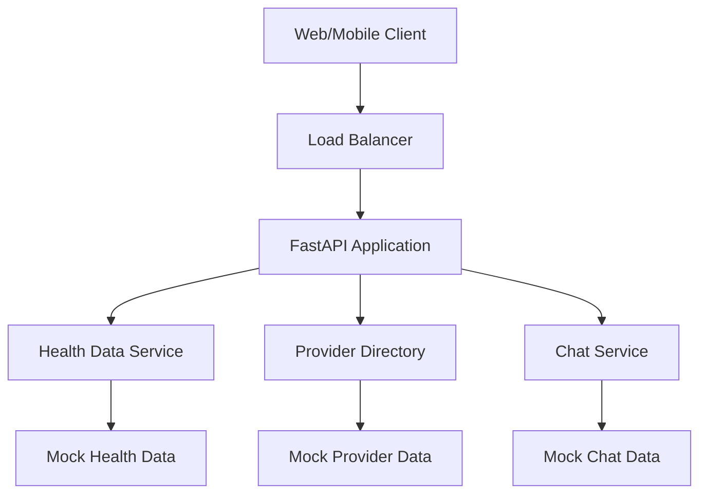

# Aarogyadost Backend API - Architecture Overview

## 🏗️ System Architecture

### Platform & Infrastructure
- **Cloud Provider**: AWS
- **Deployment**: Elastic Beanstalk (ap-south-1 Mumbai)
- **Runtime**: Python 3.11 on Amazon Linux 2023
- **Instance Type**: t3.micro (Free Tier)
- **Framework**: FastAPI
- **Data**: Mock data (no external database)

### Environments
| Environment | Domain | Status |
|-------------|--------|--------|
| **Development** | https://api-dev.arogyadost.in | ✅ Active |
| **Production** | https://api.arogyadost.in | ✅ Active |

## 🔐 Security & SSL
- **HTTPS**: Full SSL encryption with wildcard certificate (*.arogyadost.in)
- **Mixed Content**: Resolved for secure web app integration

## 🚀 CI/CD Pipeline
- **Dev Branch** → Auto-deploy to Development
- **Main Branch** → Auto-deploy to Production
- **GitHub Actions**: Automated deployment workflow

## 📡 API Endpoints Overview

### Health Data Management
```
GET /api/health/biomarkers     # Health categories & scores
GET /api/health/recommendations # Recommended actions
GET /api/health/metrics        # Health metrics data
GET /api/health/status         # Overall health status
GET /api/biomarkers/{id}       # Detailed biomarker info
```

### Healthcare Provider Directory
```
GET /api/doctors               # List of doctors
GET /api/doctors/{id}          # Doctor profile details
GET /api/labs                  # List of laboratories
GET /api/labs/{id}             # Lab details & services
```

### Communication System
```
GET /api/chat/threads          # User chat history
POST /api/chat/message         # Send new message
```

## 🎯 Key Features

### Health Analytics
- **Biomarker Tracking**: Comprehensive health data analysis
- **Personalized Recommendations**: AI-driven health suggestions
- **Status Monitoring**: Real-time health status updates

### Provider Network
- **Doctor Directory**: Searchable healthcare provider database
- **Lab Services**: Laboratory network integration
- **Detailed Profiles**: Complete provider information

### Patient Communication
- **Chat System**: Threaded messaging capability
- **Message History**: Persistent conversation tracking

## 📊 Technical Specifications

### API Documentation
- **Swagger UI**: `/docs` endpoint
- **ReDoc**: `/redoc` endpoint
- **Interactive Testing**: Built-in API explorer

### Development Workflow
```bash
# Local Development
pip install -r requirements.txt
uvicorn main:app --reload
# → http://localhost:8000
```

### Scalability Considerations
- **Stateless Design**: No database dependencies
- **Mock Data**: Rapid prototyping & testing
- **Cloud-Native**: AWS Elastic Beanstalk auto-scaling

## 🔄 Data Flow Architecture



## 📈 Current Status
- ✅ **MVP Complete**: Core functionality implemented
- ✅ **Dual Environment**: Dev/Prod deployment ready
- ✅ **SSL Secured**: Production-grade security
- ✅ **Auto-Deploy**: CI/CD pipeline active
- 🔄 **Mock Data**: Ready for database integration

## 🎯 Next Steps Considerations
- Database integration (PostgreSQL/MongoDB)
- Authentication & authorization system
- Rate limiting & API security
- Monitoring & logging infrastructure
- Performance optimization & caching
