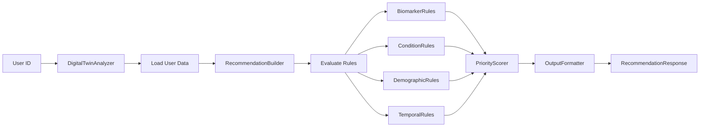

# Health Recommendations Engine

## Overview

The Aarogyadost Recommendations Engine is a rule-based system that generates personalized health recommendations based on a user's digital twin data. It analyzes biomarkers, medical conditions, demographics, and temporal patterns to provide actionable health guidance.

## Architecture

### Components

```
RecommendationEngine
├── DigitalTwinAnalyzer    # Loads and analyzes user data
├── RecommendationBuilder  # Builds recommendations using rules
│   ├── BiomarkerRules     # Biomarker-based recommendations
│   ├── ConditionRules     # Medical condition-based recommendations
│   ├── DemographicRules   # Age/gender-based recommendations
│   └── TemporalRules      # Time-based recommendations
├── PriorityScorer         # Assigns priority levels
└── OutputFormatter        # Formats final response
```

### Data Flow



## Rule System

### Rule Types

#### 1. Biomarker Rules

Evaluate lab results and vital signs to recommend tests and monitoring.

**Example Rules**:
- HbA1c > 5.7% → Recommend glucose monitoring
- Vitamin D < 30 ng/mL → Recommend Vitamin D supplementation
- HDL < 40 mg/dL → Recommend lipid panel retest
- TSH outside 0.5-4.0 → Recommend thyroid function tests

**Implementation**:
```python
class BiomarkerRules:
    def evaluate(self, digital_twin: DigitalTwin) -> List[Recommendation]:
        recommendations = []
        
        # Get biomarker domain
        biomarkers = digital_twin.get_domain('biomarkers')
        
        # HbA1c rule
        hba1c = self._get_latest_value(biomarkers, 'hba1c')
        if hba1c and hba1c > 5.7:
            recommendations.append(
                Recommendation(
                    test_name="Continuous Glucose Monitoring",
                    category="blood_test",
                    reason="HbA1c elevated - monitor glucose patterns",
                    frequency="monthly",
                    urgency="high"
                )
            )
        
        return recommendations
```

#### 2. Condition Rules

Generate recommendations based on existing medical conditions.

**Example Rules**:
- Diabetes → Recommend HbA1c every 3 months
- Hypertension → Recommend blood pressure monitoring
- Thyroid disorder → Recommend TSH every 6 months
- Cardiovascular disease → Recommend lipid panel quarterly

**Implementation**:
```python
class ConditionRules:
    def evaluate(self, digital_twin: DigitalTwin) -> List[Recommendation]:
        recommendations = []
        
        # Get medical history
        medical_history = digital_twin.get_domain('medical_history')
        conditions = self._get_conditions(medical_history)
        
        if 'diabetes' in conditions:
            recommendations.append(
                Recommendation(
                    test_name="HbA1c Test",
                    category="blood_test",
                    reason="Diabetes management - quarterly monitoring",
                    frequency="quarterly",
                    urgency="high"
                )
            )
        
        return recommendations
```

#### 3. Demographic Rules

Age and gender-specific screening recommendations.

**Example Rules**:
- Age > 40 → Annual comprehensive metabolic panel
- Age > 50 → Colonoscopy screening
- Female + Age > 40 → Annual mammogram
- Male + Age > 50 → PSA screening

**Implementation**:
```python
class DemographicRules:
    def evaluate(self, digital_twin: DigitalTwin) -> List[Recommendation]:
        recommendations = []
        
        demographics = digital_twin.get_domain('demographics')
        age = self._get_latest_value(demographics, 'age')
        gender = self._get_latest_value(demographics, 'gender')
        
        if age and age > 40:
            recommendations.append(
                Recommendation(
                    test_name="Comprehensive Metabolic Panel",
                    category="blood_test",
                    reason="Age-appropriate preventive screening",
                    frequency="annually",
                    urgency="medium"
                )
            )
        
        return recommendations
```

#### 4. Temporal Rules

Time-based recommendations for test scheduling.

**Example Rules**:
- Last lipid panel > 1 year ago → Recommend retest
- Last vitamin D test > 6 months ago → Recommend retest
- No baseline biomarkers → Recommend comprehensive panel

**Implementation**:
```python
class TemporalRules:
    def evaluate(self, digital_twin: DigitalTwin) -> List[Recommendation]:
        recommendations = []
        
        biomarkers = digital_twin.get_domain('biomarkers')
        
        # Check last lipid panel
        last_lipid_test = self._get_last_test_date(biomarkers, 'lipid_panel')
        if not last_lipid_test or self._days_since(last_lipid_test) > 365:
            recommendations.append(
                Recommendation(
                    test_name="Lipid Panel",
                    category="blood_test",
                    reason="Annual lipid screening due",
                    frequency="annually",
                    urgency="medium"
                )
            )
        
        return recommendations
```

### Priority Scoring

The priority scorer assigns urgency levels based on multiple factors:

**Scoring Factors**:
- Biomarker severity (how far from optimal range)
- Medical condition risk level
- Time since last test
- Age-related risk factors
- Family history

**Priority Levels**:
- **High**: Immediate action needed (abnormal results, overdue critical tests)
- **Medium**: Important but not urgent (preventive screening, routine monitoring)
- **Low**: Optional or long-term planning (optimization, advanced testing)

**Implementation**:
```python
class PriorityScorer:
    def assign_priorities(
        self, 
        recommendations: List[Recommendation],
        digital_twin: DigitalTwin
    ) -> List[Recommendation]:
        
        for rec in recommendations:
            score = 0
            
            # Factor 1: Urgency from rule
            if rec.urgency == "high":
                score += 50
            elif rec.urgency == "medium":
                score += 30
            
            # Factor 2: Time since last test
            days_overdue = self._calculate_overdue_days(rec, digital_twin)
            if days_overdue > 90:
                score += 20
            
            # Factor 3: Condition severity
            if self._has_high_risk_condition(digital_twin):
                score += 15
            
            # Assign priority level
            if score >= 70:
                rec.priority = "high"
            elif score >= 40:
                rec.priority = "medium"
            else:
                rec.priority = "low"
        
        return recommendations
```

## API Endpoints

### Get Recommendations

```http
GET /api/recommendations/{user_id}

Response:
{
  "user_id": "test_user_1",
  "generated_at": "2024-01-15T10:30:00Z",
  "summary": {
    "total_recommendations": 12,
    "high_priority_count": 3,
    "medium_priority_count": 6,
    "low_priority_count": 3,
    "categories_covered": ["blood_test", "lifestyle", "monitoring"]
  },
  "recommendations": [
    {
      "id": "rec_001",
      "test_name": "HbA1c Test",
      "category": "blood_test",
      "priority": "high",
      "reason": "HbA1c elevated at 5.8% - monitor glucose control",
      "frequency": "quarterly",
      "estimated_cost": "₹500",
      "preparation": "Fasting not required",
      "next_due_date": "2024-04-15"
    },
    {
      "id": "rec_002",
      "test_name": "Vitamin D Test",
      "category": "blood_test",
      "priority": "high",
      "reason": "Vitamin D deficient at 28 ng/mL",
      "frequency": "every_6_months",
      "estimated_cost": "₹800",
      "preparation": "No special preparation needed",
      "next_due_date": "2024-07-15"
    }
  ],
  "grouped_by_category": {
    "blood_test": [
      {
        "test_name": "HbA1c Test",
        "priority": "high",
        "reason": "..."
      }
    ],
    "lifestyle": [
      {
        "test_name": "Continuous Glucose Monitoring",
        "priority": "medium",
        "reason": "..."
      }
    ]
  }
}
```

### Get Recommendations Summary

```http
GET /api/recommendations/{user_id}/summary

Response:
{
  "user_id": "test_user_1",
  "generated_at": "2024-01-15T10:30:00Z",
  "summary": {
    "total_recommendations": 12,
    "high_priority_count": 3,
    "medium_priority_count": 6,
    "low_priority_count": 3,
    "categories_covered": ["blood_test", "lifestyle", "monitoring"]
  }
}
```

## Data Models

### Recommendation

```python
class Recommendation:
    id: str
    test_name: str
    category: str  # blood_test, lifestyle, monitoring
    priority: str  # high, medium, low
    reason: str
    frequency: str  # daily, weekly, monthly, quarterly, annually
    estimated_cost: Optional[str]
    preparation: Optional[str]
    next_due_date: Optional[datetime]
    metadata: Dict[str, Any]
```

### RecommendationResponse

```python
class RecommendationResponse:
    user_id: str
    generated_at: datetime
    summary: RecommendationSummary
    recommendations: List[Recommendation]
    grouped_by_category: Dict[str, List[Recommendation]]
```

### RecommendationSummary

```python
class RecommendationSummary:
    total_recommendations: int
    high_priority_count: int
    medium_priority_count: int
    low_priority_count: int
    categories_covered: List[str]
```

## Usage Examples

### Python Client

```python
import httpx

# Get recommendations for a user
response = httpx.get(
    "http://localhost:8000/api/recommendations/test_user_1"
)

data = response.json()

# Print high priority recommendations
high_priority = [
    rec for rec in data['recommendations'] 
    if rec['priority'] == 'high'
]

for rec in high_priority:
    print(f"⚠️  {rec['test_name']}")
    print(f"   Reason: {rec['reason']}")
    print(f"   Frequency: {rec['frequency']}")
    print()
```

### JavaScript/TypeScript Client

```typescript
// Fetch recommendations
const response = await fetch(
  'http://localhost:8000/api/recommendations/test_user_1'
);
const data = await response.json();

// Group by priority
const byPriority = {
  high: data.recommendations.filter(r => r.priority === 'high'),
  medium: data.recommendations.filter(r => r.priority === 'medium'),
  low: data.recommendations.filter(r => r.priority === 'low')
};

console.log(`High priority: ${byPriority.high.length} items`);
```

## Integration with Digital Twin

The recommendation engine requires a populated digital twin:

```python
# 1. Create digital twin
httpx.post(
    "http://localhost:8000/api/digital-twin/users/user123/create"
)

# 2. Add biomarker data
httpx.post(
    "http://localhost:8000/api/digital-twin/users/user123/data",
    json={
        "domain": "biomarkers",
        "field": "hba1c",
        "value": 5.8,
        "unit": "%"
    }
)

# 3. Add medical history
httpx.post(
    "http://localhost:8000/api/digital-twin/users/user123/data",
    json={
        "domain": "medical_history",
        "field": "conditions",
        "value": ["diabetes", "hypertension"]
    }
)

# 4. Generate recommendations
response = httpx.get(
    "http://localhost:8000/api/recommendations/user123"
)
```

## Customization

### Adding New Rules

To add a new rule type:

1. Create a new rule evaluator class:
```python
class CustomRules:
    def evaluate(self, digital_twin: DigitalTwin) -> List[Recommendation]:
        recommendations = []
        # Your rule logic here
        return recommendations
```

2. Register in RecommendationBuilder:
```python
class RecommendationBuilder:
    def __init__(self):
        self.biomarker_rules = BiomarkerRules()
        self.condition_rules = ConditionRules()
        self.demographic_rules = DemographicRules()
        self.temporal_rules = TemporalRules()
        self.custom_rules = CustomRules()  # Add here
```

3. Evaluate in build_recommendations:
```python
def build_recommendations(self, digital_twin: DigitalTwin):
    recommendations = []
    recommendations.extend(self.biomarker_rules.evaluate(digital_twin))
    recommendations.extend(self.condition_rules.evaluate(digital_twin))
    recommendations.extend(self.demographic_rules.evaluate(digital_twin))
    recommendations.extend(self.temporal_rules.evaluate(digital_twin))
    recommendations.extend(self.custom_rules.evaluate(digital_twin))  # Add here
    return recommendations
```

### Modifying Priority Scoring

Adjust weights in PriorityScorer:

```python
class PriorityScorer:
    # Adjust these weights
    URGENCY_WEIGHT = 50
    OVERDUE_WEIGHT = 20
    CONDITION_WEIGHT = 15
    AGE_WEIGHT = 10
```

## Testing

### Unit Tests

```python
def test_biomarker_rules_hba1c():
    """Test HbA1c rule generates recommendation"""
    twin = DigitalTwin(user_id="test")
    twin.set_value("biomarkers", "hba1c", 6.0, unit="%")
    
    rules = BiomarkerRules()
    recommendations = rules.evaluate(twin)
    
    assert len(recommendations) > 0
    assert any("HbA1c" in rec.test_name for rec in recommendations)
```

### Property-Based Tests

```python
from hypothesis import given, strategies as st

@given(
    hba1c=st.floats(min_value=4.0, max_value=15.0)
)
def test_hba1c_recommendations_property(hba1c):
    """HbA1c > 5.7 should always generate recommendation"""
    twin = DigitalTwin(user_id="test")
    twin.set_value("biomarkers", "hba1c", hba1c, unit="%")
    
    rules = BiomarkerRules()
    recommendations = rules.evaluate(twin)
    
    if hba1c > 5.7:
        assert len(recommendations) > 0
    else:
        # May or may not have recommendations
        assert len(recommendations) >= 0
```

### Integration Tests

```python
def test_full_recommendation_flow():
    """Test complete recommendation generation"""
    # Create digital twin with data
    twin = create_test_digital_twin()
    
    # Generate recommendations
    engine = RecommendationEngine()
    response = engine.generate_recommendations(twin.user_id)
    
    # Verify response structure
    assert response.user_id == twin.user_id
    assert response.summary.total_recommendations > 0
    assert len(response.recommendations) > 0
    assert len(response.grouped_by_category) > 0
```

## Performance Considerations

- **Rule Evaluation**: O(n) where n = number of rules
- **Priority Scoring**: O(m) where m = number of recommendations
- **Caching**: Consider caching recommendations for 24 hours
- **Async Processing**: All operations are async-ready

## Error Handling

The engine handles various error scenarios:

```python
try:
    response = engine.generate_recommendations(user_id)
except ValueError as e:
    # Missing required data
    return {"error": "Insufficient data", "details": str(e)}
except Exception as e:
    # Unexpected error
    return {"error": "Internal error", "details": str(e)}
```

## Monitoring

### Metrics to Track

- Recommendations generated per user
- Average recommendations per category
- Priority distribution (high/medium/low)
- Rule evaluation time
- Error rates

### Logging

```python
import logging

logger = logging.getLogger(__name__)

logger.info(f"Generating recommendations for user: {user_id}")
logger.info(f"Generated {len(recommendations)} recommendations")
logger.error(f"Error generating recommendations: {str(e)}")
```

## Future Enhancements

1. **Machine Learning**: Learn from user actions and outcomes
2. **Personalization**: Adapt rules based on user preferences
3. **Cost Optimization**: Recommend most cost-effective tests
4. **Lab Integration**: Direct booking and scheduling
5. **Outcome Tracking**: Measure recommendation effectiveness
6. **A/B Testing**: Test different rule configurations
7. **Multi-language**: Support for regional languages
8. **Insurance Integration**: Filter by coverage
